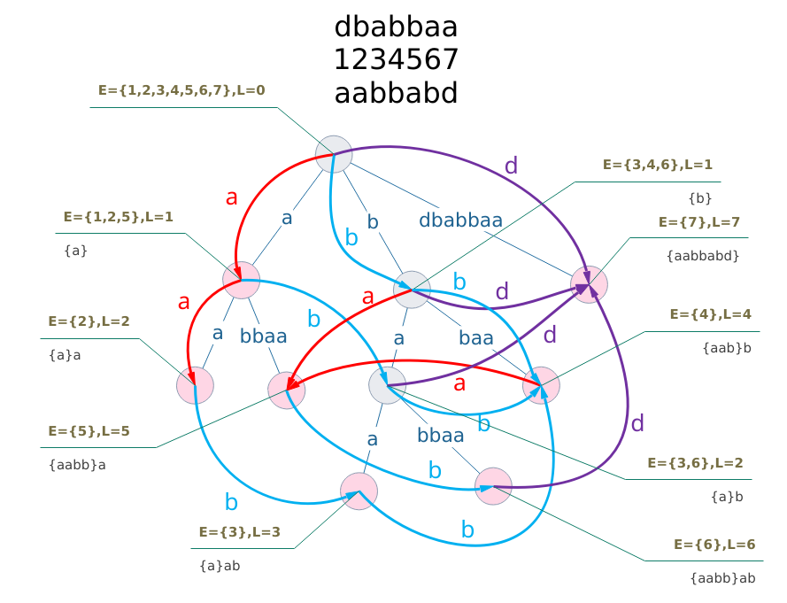

# 一切的开始

## 宏定义

* 需要 C++11

```cpp
#include <bits/stdc++.h>
using namespace std;
using LL = long long;
#define FOR(i, x, y) for (decay<decltype(y)>::type i = (x), _##i = (y); i < _##i; ++i)
#define FORD(i, x, y) for (decay<decltype(x)>::type i = (x), _##i = (y); i > _##i; --i)
#ifdef zerol
#define dbg(x...) do { cout << "\033[32;1m" << #x << " -> "; err(x); } while (0)
void err() { cout << "\033[39;0m" << endl; }
template<template<typename...> class T, typename t, typename... A>
void err(T<t> a, A... x) { for (auto v: a) cout << v << ' '; err(x...); }
template<typename T, typename... A>
void err(T a, A... x) { cout << a << ' '; err(x...); }
#else
#define dbg(...)
#endif
// -----------------------------------------------------------------------------
```

+ 更多配色：
  + 33 黄色
  + 34 蓝色
  + 31 橙色

+ POJ/BZOJ version

```cpp
#include <cstdio>
#include <iostream>
#include <algorithm>
#include <cmath>
#include <string>
#include <vector>
#include <set>
#include <queue>
#include <cstring>
#include <cassert>
using namespace std;
typedef long long LL;
#define FOR(i, x, y) for (LL i = (x), _##i = (y); i < _##i; ++i)
#define FORD(i, x, y) for (LL i = (x), _##i = (y); i > _##i; --i)
#ifdef zerol
#define dbg(args...) do { cout << "\033[32;1m" << #args<< " -> "; err(args); } while (0)
void err() { cout << "\033[39;0m" << endl; }
template<typename T, typename... Args>
void err(T a, Args... args) { cout << a << ' '; err(args...); }
#else
#define dbg(...)
#endif
// -----------------------------------------------------------------------------
```

+ HDU Assert Patch

```cpp
#ifdef ONLINE_JUDGE
#define assert(condition) if (!(condition)) { int x = 1, y = 0; cout << x / y << endl; }
#endif
```

## 快速读

```cpp
inline char nc() {
    static char buf[100000], *p1 = buf, *p2 = buf;
    return p1 == p2 && (p2 = (p1 = buf) + fread(buf, 1, 100000, stdin), p1 == p2) ? EOF : *p1++;
}
template <typename T>
bool rn(T& v) {
    static char ch;
    while (ch != EOF && !isdigit(ch)) ch = nc();
    if (ch == EOF) return false;
    for (v = 0; isdigit(ch); ch = nc())
        v = v * 10 + ch - '0';
    return true;
}

template <typename T>
void o(T p) {
    static int stk[70], tp;
    if (p == 0) { putchar('0'); return; }
    if (p < 0) { p = -p; putchar('-'); }
    while (p) stk[++tp] = p % 10, p /= 10;
    while (tp) putchar(stk[tp--] + '0');
}
```
+ 需要初始化
+ 需要一次读入
+ 不支持负数

```cpp
const int MAXS = 100 * 1024 * 1024;
char buf[MAXS];
template<typename T>
inline bool read(T& x) {
    static char* p = buf;
    x = 0;
    while (*p && !isdigit(*p)) ++p;
    if (!*p) return false;
    while (isdigit(*p)) x = x * 10 + *p++ - 48;
    return true;
}

fread(buf, 1, MAXS, stdin);
```

## 快速输出
+ 别忘了flush
```cpp
namespace output {
    const int OutputBufferSize = 1e6+5;

    char buffer[OutputBufferSize];
    char *s = buffer;
    inline void flush() {
        fwrite(buffer, 1, s-buffer, stdout);
        s = buffer;
        fflush(stdout);
    }
    inline void print(const char ch) {
        if (s-buffer>OutputBufferSize-2) flush();
        *s++ = ch;
    }
    inline void print(char *str) {
        while (*str!=0) print(char(*str++));
    }
    inline void print(int x) {
        char buf[25] = {0}, *p = buf;
        if (x<0) print('-'), x=-x;
        if (x == 0) print('0');
        while (x) *(++p) = x%10, x/=10;
        while (p != buf) print(char(*(p--)+'0'));
    }
}
```

## 对拍

```bash
#!/usr/bin/env bash
g++ -o r main.cpp -O2 -std=c++11
g++ -o std std.cpp -O2 -std=c++11
while true; do
    python gen.py > in
    ./std < in > stdout
    ./r < in > out
    if test $? -ne 0; then
        exit 0
    fi
    if diff stdout out; then
        printf "AC\n"
    else
        printf "GG\n"
        exit 0
    fi
done
```

+ 快速编译运行

```bash
#!/bin/bash
g++ $1.cpp -o $1 -O2 -std=c++14 -Wall -Dzerol -g
if $? -eq 0; then
	./$1
fi
```


## 为什么 C++ 不自带这个？

```cpp
LL bin(LL x, LL n, LL MOD) {
    LL ret = MOD != 1;
    for (x %= MOD; n; n >>= 1, x = x * x % MOD)
        if (n & 1) ret = ret * x % MOD;
    return ret;
}
inline LL get_inv(LL x, LL p) { return bin(x, p - 2, p); }
```

# 数学

## 矩阵运算

```cpp
struct Mat {
    static const LL M = 2;
    LL v[M][M];
    Mat() { memset(v, 0, sizeof v); }
    void eye() { FOR (i, 0, M) v[i][i] = 1; }
    LL* operator [] (LL x) { return v[x]; }
    const LL* operator [] (LL x) const { return v[x]; }
    Mat operator * (const Mat& B) {
        const Mat& A = *this;
        Mat ret;
        FOR (k, 0, M)
            FOR (i, 0, M) if (A[i][k])
                FOR (j, 0, M)     
                    ret[i][j] = (ret[i][j] + A[i][k] * B[k][j]) % MOD;
        return ret;
    }
    Mat pow(LL n) const {
        Mat A = *this, ret; ret.eye();
        for (; n; n >>= 1, A = A * A)
            if (n & 1) ret = ret * A;
        return ret;
    }
    Mat operator + (const Mat& B) {
        const Mat& A = *this;
        Mat ret;
        FOR (i, 0, M)
            FOR (j, 0, M)
                 ret[i][j] = (A[i][j] + B[i][j]) % MOD;
        return ret;
    }
    void prt() const {
        FOR (i, 0, M)
            FOR (j, 0, M)
                 printf("%lld%c", (*this)[i][j], j == M - 1 ? '\n' : ' ');
    }
};
```

## 筛

* 线性筛

```cpp
const LL p_max = 1E6 + 100;
LL pr[p_max], p_sz;
void get_prime() {
    static bool vis[p_max];
    FOR (i, 2, p_max) {
        if (!vis[i]) pr[p_sz++] = i;
        FOR (j, 0, p_sz) {
            if (pr[j] * i >= p_max) break;
            vis[pr[j] * i] = 1;
            if (i % pr[j] == 0) break;
        }
    }
}
```

* 线性筛+欧拉函数

```cpp
const LL p_max = 1E5 + 100;
LL phi[p_max];
void get_phi() {
    phi[1] = 1;
    static bool vis[p_max];
    static LL prime[p_max], p_sz, d;
    FOR (i, 2, p_max) {
        if (!vis[i]) {
            prime[p_sz++] = i;
            phi[i] = i - 1;
        }
        for (LL j = 0; j < p_sz && (d = i * prime[j]) < p_max; ++j) {
            vis[d] = 1;
            if (i % prime[j] == 0) {
                phi[d] = phi[i] * prime[j];
                break;
            }
            else phi[d] = phi[i] * (prime[j] - 1);
        }
    }
}
```


* 线性筛+莫比乌斯函数

```cpp
const LL p_max = 1E5 + 100;
LL mu[p_max];
void get_mu() {
    mu[1] = 1;
    static bool vis[p_max];
    static LL prime[p_max], p_sz, d;
    mu[1] = 1;
    FOR (i, 2, p_max) {
        if (!vis[i]) {
            prime[p_sz++] = i;
            mu[i] = -1;
        }
        for (LL j = 0; j < p_sz && (d = i * prime[j]) < p_max; ++j) {
            vis[d] = 1;
            if (i % prime[j] == 0) {
                mu[d] = 0;
                break;
            }
            else mu[d] = -mu[i];
        }
    }
}
```

## 亚线性筛

### min_25

```cpp
namespace min25 {
    const int M = 1E6 + 100;
    LL B, N;

    // g(x)
    inline LL pg(LL x) { return 1; }
    inline LL ph(LL x) { return x % MOD; }
    // Sum[g(i),{x,2,x}]
    inline LL psg(LL x) { return x % MOD - 1; }
    inline LL psh(LL x) {
        static LL inv2 = (MOD + 1) / 2;
        x = x % MOD;
        return x * (x + 1) % MOD * inv2 % MOD - 1;
    }
    // f(pp=p^k)
    inline LL fpk(LL p, LL e, LL pp) { return (pp - pp / p) % MOD; }
    // f(p) = fgh(g(p), h(p))
    inline LL fgh(LL g, LL h) { return h - g; }

    LL pr[M], pc, sg[M], sh[M];
    void get_prime(LL n) {
        static bool vis[M]; pc = 0;
        FOR (i, 2, n + 1) {
            if (!vis[i]) {
                pr[pc++] = i;
                sg[pc] = (sg[pc - 1] + pg(i)) % MOD;
                sh[pc] = (sh[pc - 1] + ph(i)) % MOD;
            }
            FOR (j, 0, pc) {
                if (pr[j] * i > n) break;
                vis[pr[j] * i] = 1;
                if (i % pr[j] == 0) break;
            }
        }
    }

    LL w[M];
    LL id1[M], id2[M], h[M], g[M];
    inline LL id(LL x) { return x <= B ? id1[x] : id2[N / x]; }

    LL go(LL x, LL k) {
        if (x <= 1 || (k >= 0 && pr[k] > x)) return 0;
        LL t = id(x);
        LL ans = fgh((g[t] - sg[k + 1]), (h[t] - sh[k + 1]));
        FOR (i, k + 1, pc) {
            LL p = pr[i];
            if (p * p > x) break;
            ans -= fgh(pg(p), ph(p));
            for (LL pp = p, e = 1; pp <= x; ++e, pp = pp * p)
                ans += fpk(p, e, pp) * (1 + go(x / pp, i)) % MOD;
        }
        return ans % MOD;
    }

    LL solve(LL _N) {
        N = _N;
        B = sqrt(N + 0.5);
        get_prime(B);
        int sz = 0;
        for (LL l = 1, v, r; l <= N; l = r + 1) {
            v = N / l; r = N / v;
            w[sz] = v; g[sz] = psg(v); h[sz] = psh(v);
            if (v <= B) id1[v] = sz; else id2[r] = sz;
            sz++;
        }
        FOR (k, 0, pc) {
            LL p = pr[k];
            FOR (i, 0, sz) {
                LL v = w[i]; if (p * p > v) break;
                LL t = id(v / p);
                g[i] = (g[i] - (g[t] - sg[k]) * pg(p)) % MOD;
                h[i] = (h[i] - (h[t] - sh[k]) * ph(p)) % MOD;
            }
        }
        return (go(N, -1) % MOD + MOD + 1) % MOD;
    }
}
```

### 杜教筛

求 $S(n)=\sum_{i=1}^n f(i)$，其中 $f$ 是一个积性函数。

构造一个积性函数 $g$，那么由 $(f*g)(n)=\sum_{d|n}f(d)g(\frac{n}{d})$，得到 $f(n)=(f*g)(n)-\sum_{d|n,d<n}f(d)g(\frac{n}{d})$。

当然，要能够由此计算 $S(n)$，会对 $f,g$ 提出一些要求：

+ $f*g$ 要能够快速求前缀和。
+ $g$  要能够快速求分段和（前缀和）。
+ 对于正常的积性函数 $g(1)=1$，所以不会有什么问题。

在预处理 $S(n)$ 前 $n^{\frac{2}{3}}$ 项的情况下复杂度是 $O(n^{\frac{2}{3}})$。

```cpp
namespace dujiao {
    const int M = 5E6;
    LL f[M] = {0, 1};
    void init() {
        static bool vis[M];
        static LL pr[M], p_sz, d;
        FOR (i, 2, M) {
            if (!vis[i]) { pr[p_sz++] = i; f[i] = -1; }
            FOR (j, 0, p_sz) {
                if ((d = pr[j] * i) >= M) break;
                vis[d] = 1;
                if (i % pr[j] == 0) {
                    f[d] = 0;
                    break;
                } else f[d] = -f[i];
            }
        }
        FOR (i, 2, M) f[i] += f[i - 1];
    }
    inline LL s_fg(LL n) { return 1; }
    inline LL s_g(LL n) { return n; }

    LL N, rd[M];
    bool vis[M];
    LL go(LL n) {
        if (n < M) return f[n];
        LL id = N / n;
        if (vis[id]) return rd[id];
        vis[id] = true;
        LL& ret = rd[id] = s_fg(n);
        for (LL l = 2, v, r; l <= n; l = r + 1) {
            v = n / l; r = n / v;
            ret -= (s_g(r) - s_g(l - 1)) * go(v);
        }
        return ret;
    }
    LL solve(LL n) {
        N = n;
        memset(vis, 0, sizeof vis);
        return go(n);
    }
}
```


## 素数测试

+ 前置： 快速乘、快速幂
+ int 范围内只需检查 2, 7, 61
+ long long 范围 2, 325, 9375, 28178, 450775, 9780504, 1795265022
+ 3E15内 2, 2570940, 880937, 610386380, 4130785767
+ 4E13内 2, 2570940, 211991001, 3749873356
+ http://miller-rabin.appspot.com/

```cpp
bool checkQ(LL a, LL n) {
    if (n == 2 || a >= n) return 1;
    if (n == 1 || !(n & 1)) return 0;
    LL d = n - 1;
    while (!(d & 1)) d >>= 1;
    LL t = bin(a, d, n);  // 不一定需要快速乘
    while (d != n - 1 && t != 1 && t != n - 1) {
        t = mul(t, t, n);
        d <<= 1;
    }
    return t == n - 1 || d & 1;
}

bool primeQ(LL n) {
    static vector<LL> t = {2, 325, 9375, 28178, 450775, 9780504, 1795265022};
    if (n <= 1) return false;
    for (LL k: t) if (!checkQ(k, n)) return false;
    return true;
}
```

## Pollard-Rho

+ 大整数分解

```cpp
mt19937 mt(time(0));
LL pollard_rho(LL n, LL c) {
    LL x = uniform_int_distribution<LL>(1, n - 1)(mt), y = x;
    auto f = [&](LL v) { LL t = mul(v, v, n) + c; return t < n ? t : t - n; };
    while (1) {
        x = f(x); y = f(f(y));
        if (x == y) return n;
        LL d = gcd(abs(x - y), n);
        if (d != 1) return d;
    }
}

LL fac[100], fcnt; // 结果
void get_fac(LL n, LL cc = 19260817) {
    if (n == 4) { fac[fcnt++] = 2; fac[fcnt++] = 2; return; }
    if (primeQ(n)) { fac[fcnt++] = n; return; }
    LL p = n;
    while (p == n) p = pollard_rho(n, --cc);
    get_fac(p); get_fac(n / p);
}
```

## BM 线性递推

```cpp
namespace BerlekampMassey {
    inline void up(LL& a, LL b) { (a += b) %= MOD; }
    V mul(const V&a, const V& b, const V& m, int k) {
        V r; r.resize(2 * k - 1);
        FOR (i, 0, k) FOR (j, 0, k) up(r[i + j], a[i] * b[j]);
        FORD (i, k - 2, -1) {
            FOR (j, 0, k) up(r[i + j], r[i + k] * m[j]);
            r.pop_back();
        }
        return r;
    }
    
    V pow(LL n, const V& m) {
        int k = (int) m.size() - 1; assert (m[k] == -1 || m[k] == MOD - 1);
        V r(k), x(k); r[0] = x[1] = 1;
        for (; n; n >>= 1, x = mul(x, x, m, k))
            if (n & 1) r = mul(x, r, m, k);
        return r;
    }
    
    LL go(const V& a, const V& x, LL n) {
        // a: (-1, a1, a2, ..., ak).reverse
        // x: x1, x2, ..., xk
        // x[n] = sum[a[i]*x[n-i],{i,1,k}]
        int k = (int) a.size() - 1;
        if (n <= k) return x[n - 1];
        if (a.size() == 2) return x[0] * bin(a[0], n - 1, MOD) % MOD;
        V r = pow(n - 1, a);
        LL ans = 0;
        FOR (i, 0, k) up(ans, r[i] * x[i]);
        return (ans + MOD) % MOD;
    }
    
    V BM(const V& x) {
        V a = {-1}, b = {233}, t;
        FOR (i, 1, x.size()) {
            b.push_back(0);
            LL d = 0, la = a.size(), lb = b.size();
            FOR (j, 0, la) up(d, a[j] * x[i - la + 1 + j]);
            if (d == 0) continue;
            t.clear(); for (auto& v: b) t.push_back(d * v % MOD);
            FOR (_, 0, la - lb) t.push_back(0);
            lb = max(la, lb);
            FOR (j, 0, la) up(t[lb - 1 - j], a[la - 1 - j]);
            if (lb > la) {
                b.swap(a);
                LL inv = -get_inv(d, MOD);
                for (auto& v: b) v = v * inv % MOD;
            }
            a.swap(t);
        }
        for (auto& v: a) up(v, MOD);
        return a;
    }
}
```

## 扩展欧几里得

* 求 $ax+by=gcd(a,b)$ 的一组解
* 如果 $a$ 和 $b$ 互素，那么 $x$ 是 $a$ 在模 $b$ 下的逆元
* 注意 $x$ 和 $y$ 可能是负数

```cpp
LL ex_gcd(LL a, LL b, LL &x, LL &y) {
    if (b == 0) { x = 1; y = 0; return a; }
    LL ret = ex_gcd(b, a % b, y, x);
    y -= a / b * x;
    return ret;
}
```

+ 卡常欧几里得

```cpp
inline int ctz(LL x) { return __builtin_ctzll(x); }
LL gcd(LL a, LL b) {
    if (!a) return b; if (!b) return a;
    int t = ctz(a | b);
    a >>= ctz(a);
    do {
        b >>= ctz(b);
        if (a > b) swap(a, b);
        b -= a;
    } while (b);
    return a << t;
}
```

## 类欧几里得

* $m = \lfloor \frac{an+b}{c} \rfloor$.
* $f(a,b,c,n)=\sum_{i=0}^n\lfloor\frac{ai+b}{c}\rfloor$: 当 $a \ge c$ or $b \ge c$ 时，$f(a,b,c,n)=(\frac{a}{c})n(n+1)/2+(\frac{b}{c})(n+1)+f(a \bmod c,b \bmod c,c,n)$；否则 $f(a,b,c,n)=nm-f(c,c-b-1,a,m-1)$。
* $g(a,b,c,n)=\sum_{i=0}^n i \lfloor\frac{ai+b}{c}\rfloor$: 当 $a \ge c$ or $b \ge c$ 时，$g(a,b,c,n)=(\frac{a}{c})n(n+1)(2n+1)/6+(\frac{b}{c})n(n+1)/2+g(a \bmod c,b \bmod c,c,n)$；否则 $g(a,b,c,n)=\frac{1}{2} (n(n+1)m-f(c,c-b-1,a,m-1)-h(c,c-b-1,a,m-1))$。
* $h(a,b,c,n)=\sum_{i=0}^n\lfloor \frac{ai+b}{c} \rfloor^2$: 当 $a \ge c$ or $b \ge c$ 时，$h(a,b,c,n)=(\frac{a}{c})^2 n(n+1)(2n+1)/6 +(\frac{b}{c})^2 (n+1)+(\frac{a}{c})(\frac{b}{c})n(n+1)+h(a \bmod c, b \bmod c,c,n)+2(\frac{a}{c})g(a \bmod c,b \bmod c,c,n)+2(\frac{b}{c})f(a \bmod c,b \bmod c,c,n)$；否则 $h(a,b,c,n)=nm(m+1)-2g(c,c-b-1,a,m-1)-2f(c,c-b-1,a,m-1)-f(a,b,c,n)$。


## 逆元

* 如果 $p$ 不是素数，使用拓展欧几里得

* 前置模板：快速幂 / 扩展欧几里得

```cpp
inline LL get_inv(LL x, LL p) { return bin(x, p - 2, p); }
LL get_inv(LL a, LL M) {
    static LL x, y;
    assert(exgcd(a, M, x, y) == 1);
    return (x % M + M) % M;
}
```

* 预处理 1~n 的逆元

```cpp
LL inv[N];
void inv_init(LL n, LL p) {
    inv[1] = 1;
    FOR (i, 2, n)
        inv[i] = (p - p / i) * inv[p % i] % p;
}
```

* 预处理阶乘及其逆元

```cpp
LL invf[M], fac[M] = {1};
void fac_inv_init(LL n, LL p) {
    FOR (i, 1, n)
        fac[i] = i * fac[i - 1] % p;
    invf[n - 1] = bin(fac[n - 1], p - 2, p);
    FORD (i, n - 2, -1)
        invf[i] = invf[i + 1] * (i + 1) % p;
}
```

## 组合数

+ 如果数较小，模较大时使用逆元
+ 前置模板：逆元-预处理阶乘及其逆元

```cpp
inline LL C(LL n, LL m) { // n >= m >= 0
    return n < m || m < 0 ? 0 : fac[n] * invf[m] % MOD * invf[n - m] % MOD;
}
```

+ 如果模数较小，数字较大，使用 Lucas 定理
+ 前置模板可选1：求组合数    （如果使用阶乘逆元，需`fac_inv_init(MOD, MOD);`）
+ 前置模板可选2：模数不固定下使用，无法单独使用。

```cpp
LL C(LL n, LL m) { // m >= n >= 0
    if (m - n < n) n = m - n;
    if (n < 0) return 0;
    LL ret = 1;
    FOR (i, 1, n + 1)
        ret = ret * (m - n + i) % MOD * bin(i, MOD - 2, MOD) % MOD;
    return ret;
}
```

```cpp
LL Lucas(LL n, LL m) { // m >= n >= 0
    return m ? C(n % MOD, m % MOD) * Lucas(n / MOD, m / MOD) % MOD : 1;
}
```

* 组合数预处理

```cpp
LL C[M][M];
void init_C(int n) {
    FOR (i, 0, n) {
        C[i][0] = C[i][i] = 1;
        FOR (j, 1, i)
            C[i][j] = (C[i - 1][j] + C[i - 1][j - 1]) % MOD;
    }
}
```

## 斯特灵数

### 第一类斯特灵数

+ 绝对值是 $n$ 个元素划分为 $k​$ 个环排列的方案数。
+ $s(n,k)=s(n-1,k-1)+(n-1)s(n-1,k)$

### 第二类斯特灵数

+ $n$  个元素划分为 $k$ 个等价类的方案数
+ $S(n, k)=S(n-1,k-1)+kS(n-1, k)$

```cpp
S[0][0] = 1;
FOR (i, 1, N)
    FOR (j, 1, i + 1) S[i][j] = (S[i - 1][j - 1] + j * S[i - 1][j]) % MOD;
```

## FFT & NTT & FWT

### NTT

```cpp
LL wn[N << 2], rev[N << 2];
int NTT_init(int n_) {
    int step = 0; int n = 1;
    for ( ; n < n_; n <<= 1) ++step;
    FOR (i, 1, n)
        rev[i] = (rev[i >> 1] >> 1) | ((i & 1) << (step - 1));
    int g = bin(G, (MOD - 1) / n, MOD);
    wn[0] = 1;
    for (int i = 1; i <= n; ++i)
        wn[i] = wn[i - 1] * g % MOD;
    return n;
}

void NTT(LL a[], int n, int f) {
    FOR (i, 0, n) if (i < rev[i])
        std::swap(a[i], a[rev[i]]);
    for (int k = 1; k < n; k <<= 1) {
        for (int i = 0; i < n; i += (k << 1)) {
            int t = n / (k << 1);
            FOR (j, 0, k) {
                LL w = f == 1 ? wn[t * j] : wn[n - t * j];
                LL x = a[i + j];
                LL y = a[i + j + k] * w % MOD;
                a[i + j] = (x + y) % MOD;
                a[i + j + k] = (x - y + MOD) % MOD;
            }
        }
    }
    if (f == -1) {
        LL ninv = get_inv(n, MOD);
        FOR (i, 0, n)
            a[i] = a[i] * ninv % MOD;
    }
}
```

### FFT

+ n 需补成 2 的幂 （n 必须超过 a 和 b 的最高指数之和）

```cpp
typedef double LD;
const LD PI = acos(-1);
struct C {
    LD r, i;
    C(LD r = 0, LD i = 0): r(r), i(i) {}
};
C operator + (const C& a, const C& b) {
    return C(a.r + b.r, a.i + b.i);
}
C operator - (const C& a, const C& b) {
    return C(a.r - b.r, a.i - b.i);
}
C operator * (const C& a, const C& b) {
    return C(a.r * b.r - a.i * b.i, a.r * b.i + a.i * b.r);
}

void FFT(C x[], int n, int p) {
    for (int i = 0, t = 0; i < n; ++i) {
        if (i > t) swap(x[i], x[t]);
        for (int j = n >> 1; (t ^= j) < j; j >>= 1);
    }
    for (int h = 2; h <= n; h <<= 1) {
        C wn(cos(p * 2 * PI / h), sin(p * 2 * PI / h));
        for (int i = 0; i < n; i += h) {
            C w(1, 0), u;
            for (int j = i, k = h >> 1; j < i + k; ++j) {
                u = x[j + k] * w;
                x[j + k] = x[j] - u;
                x[j] = x[j] + u;
                w = w * wn;
            }
        }
    }
    if (p == -1)
        FOR (i, 0, n)
            x[i].r /= n;
}

void conv(C a[], C b[], int n) {
    FFT(a, n, 1);
    FFT(b, n, 1);
    FOR (i, 0, n)
        a[i] = a[i] * b[i];
    FFT(a, n, -1);
}
```

### FWT

+ $C_k=\sum_{i \oplus j=k} A_i B_j$
+ FWT 完后需要先模一遍

```cpp
template<typename T>
void fwt(LL a[], int n, T f) {
    for (int d = 1; d < n; d *= 2)
        for (int i = 0, t = d * 2; i < n; i += t)
            FOR (j, 0, d)
                f(a[i + j], a[i + j + d]);
}

void AND(LL& a, LL& b) { a += b; }
void OR(LL& a, LL& b) { b += a; }
void XOR (LL& a, LL& b) {
    LL x = a, y = b;
    a = (x + y) % MOD;
    b = (x - y + MOD) % MOD;
}
void rAND(LL& a, LL& b) { a -= b; }
void rOR(LL& a, LL& b) { b -= a; }
void rXOR(LL& a, LL& b) {
    static LL INV2 = (MOD + 1) / 2;
    LL x = a, y = b;
    a = (x + y) * INV2 % MOD;
    b = (x - y + MOD) * INV2 % MOD;
}
```

+ FWT 子集卷积

```text
a[popcount(x)][x] = A[x]
b[popcount(x)][x] = B[x]
fwt(a[i]) fwt(b[i])
c[i + j][x] += a[i][x] * b[j][x]
rfwt(c[i])
ans[x] = c[popcount(x)][x]
```

## simpson 自适应积分

```cpp
LD simpson(LD l, LD r) {
    LD c = (l + r) / 2;
    return (f(l) + 4 * f(c) + f(r)) * (r - l) / 6;
}

LD asr(LD l, LD r, LD eps, LD S) {
    LD m = (l + r) / 2;
    LD L = simpson(l, m), R = simpson(m, r);
    if (fabs(L + R - S) < 15 * eps) return L + R + (L + R - S) / 15;
    return asr(l, m, eps / 2, L) + asr(m, r, eps / 2, R);
}

LD asr(LD l, LD r, LD eps) { return asr(l, r, eps, simpson(l, r)); }
```

+ FWT

```cpp
template<typename T>
void fwt(LL a[], int n, T f) {
    for (int d = 1; d < n; d *= 2)
        for (int i = 0, t = d * 2; i < n; i += t)
            FOR (j, 0, d)
                 f(a[i + j], a[i + j + d]);
}

auto f = [](LL& a, LL& b) { // xor
        LL x = a, y = b;
        a = (x + y) % MOD;
        b = (x - y + MOD) % MOD;
};
```

## 快速乘

```cpp
LL mul(LL a, LL b, LL m) {
    LL ret = 0;
    while (b) {
        if (b & 1) {
            ret += a;
            if (ret >= m) ret -= m;
        }
        a += a;
        if (a >= m) a -= m;
        b >>= 1;
    }
    return ret;
}
```

+ O(1)

```cpp
LL mul(LL u, LL v, LL p) {
    return (u * v - LL((long double) u * v / p) * p + p) % p;
}
LL mul(LL u, LL v, LL p) { // 卡常
    LL t = u * v - LL((long double) u * v / p) * p;
    return t < 0 ? t + p : t;
}
```

## 快速幂

* 如果模数是素数，则可在函数体内加上`n %= MOD - 1;`（费马小定理）。

```cpp
LL bin(LL x, LL n, LL MOD) {
    LL ret = MOD != 1;
    for (x %= MOD; n; n >>= 1, x = x * x % MOD)
        if (n & 1) ret = ret * x % MOD;
    return ret;
}
```

* 防爆 LL
* 前置模板：快速乘

```cpp
LL bin(LL x, LL n, LL MOD) {
    LL ret = MOD != 1;
    for (x %= MOD; n; n >>= 1, x = mul(x, x, MOD))
        if (n & 1) ret = mul(ret, x, MOD);
    return ret;
}
```

## 高斯消元

* n - 方程个数，m - 变量个数， a 是 n \* \(m + 1\) 的增广矩阵，free 是否为自由变量
* 返回自由变量个数，-1 无解

* 浮点数版本

```cpp
typedef double LD;
const LD eps = 1E-10;
const int maxn = 2000 + 10;

int n, m;
LD a[maxn][maxn], x[maxn];
bool free_x[maxn];

inline int sgn(LD x) { return (x > eps) - (x < -eps); }

int gauss(LD a[maxn][maxn], int n, int m) {
    memset(free_x, 1, sizeof free_x); memset(x, 0, sizeof x);
    int r = 0, c = 0;
    while (r < n && c < m) {
        int m_r = r;
        FOR (i, r + 1, n)
            if (fabs(a[i][c]) > fabs(a[m_r][c])) m_r = i;
        if (m_r != r)
            FOR (j, c, m + 1)
                 swap(a[r][j], a[m_r][j]);
        if (!sgn(a[r][c])) {
            a[r][c] = 0;
            ++c;
            continue;
        }
        FOR (i, r + 1, n)
            if (a[i][c]) {
                LD t = a[i][c] / a[r][c];
                FOR (j, c, m + 1) a[i][j] -= a[r][j] * t;
            }
        ++r; ++c;
    }
    FOR (i, r, n)
        if (sgn(a[i][m])) return -1;
    if (r < m) {
        FORD (i, r - 1, -1) {
            int f_cnt = 0, k = -1;
            FOR (j, 0, m)
                if (sgn(a[i][j]) && free_x[j]) {
                    ++f_cnt;
                    k = j;
                }
            if(f_cnt > 0) continue;
            LD s = a[i][m];
            FOR (j, 0, m)
                if (j != k) s -= a[i][j] * x[j];
            x[k] = s / a[i][k];
            free_x[k] = 0;
        }
        return m - r;
    }
    FORD (i, m - 1, -1) {
        LD s = a[i][m];
        FOR (j, i + 1, m)
            s -= a[i][j] * x[j];
        x[i] = s / a[i][i];
    }
    return 0;
}
```

+ 数据

```
3 4
1 1 -2 2
2 -3 5 1
4 -1 1 5
5 0 -1 7
// many

3 4
1 1 -2 2
2 -3 5 1
4 -1 -1 5
5 0 -1 0 2
// no

3 4
1 1 -2 2
2 -3 5 1
4 -1 1 5
5 0 1 0 7
// one
```

## 质因数分解

* 前置模板：素数筛

* 带指数

```cpp
LL factor[30], f_sz, factor_exp[30];
void get_factor(LL x) {
    f_sz = 0;
    LL t = sqrt(x + 0.5);
    for (LL i = 0; pr[i] <= t; ++i)
        if (x % pr[i] == 0) {
            factor_exp[f_sz] = 0;
            while (x % pr[i] == 0) {
                x /= pr[i];
                ++factor_exp[f_sz];
            }
            factor[f_sz++] = pr[i];
        }
    if (x > 1) {
        factor_exp[f_sz] = 1;
        factor[f_sz++] = x;
    }
}
```

* 不带指数

```cpp
LL factor[30], f_sz;
void get_factor(LL x) {
    f_sz = 0;
    LL t = sqrt(x + 0.5);
    for (LL i = 0; pr[i] <= t; ++i)
        if (x % pr[i] == 0) {
            factor[f_sz++] = pr[i];
            while (x % pr[i] == 0) x /= pr[i];
        }
    if (x > 1) factor[f_sz++] = x;
}
```

## 原根

* 前置模板：素数筛，快速幂，分解质因数
* 要求 p 为质数

```cpp
LL find_smallest_primitive_root(LL p) {
    get_factor(p - 1);
    FOR (i, 2, p) {
        bool flag = true;
        FOR (j, 0, f_sz)
            if (bin(i, (p - 1) / factor[j], p) == 1) {
                flag = false;
                break;
            }
        if (flag) return i;
    }
    assert(0); return -1;
}
```

## 公式

### 一些数论公式

- 当 $x\geq\phi(p)$ 时有 $a^x\equiv a^{x \; mod \; \phi(p) + \phi(p)}\pmod p$
- $\mu^2(n)=\sum_{d^2|n} \mu(d)$
- $\sum_{d|n} \varphi(d)=n$
- $\sum_{d|n} 2^{\omega(d)}=\sigma_0(n^2)$，其中 $\omega$ 是不同素因子个数
- $\sum_{d|n} \mu^2(d)=2^{\omega(d)}$

### 一些数论函数求和的例子

+ $\sum_{i=1}^n i[gcd(i, n)=1] = \frac {n \varphi(n) + [n=1]}{2}$
+ $\sum_{i=1}^n \sum_{j=1}^m [gcd(i,j)=x]=\sum_d \mu(d) \lfloor \frac n {dx} \rfloor  \lfloor \frac m {dx} \rfloor$
+ $\sum_{i=1}^n \sum_{j=1}^m gcd(i, j) = \sum_{i=1}^n \sum_{j=1}^m \sum_{d|gcd(i,j)} \varphi(d) = \sum_{d} \varphi(d) \lfloor \frac nd \rfloor \lfloor \frac md \rfloor$
+ $S(n)=\sum_{i=1}^n \mu(i)=1-\sum_{i=1}^n \sum_{d|i,d < i}\mu(d) \overset{t=\frac id}{=} 1-\sum_{t=2}^nS(\lfloor \frac nt \rfloor)$
  + 利用 $[n=1] = \sum_{d|n} \mu(d)$
+ $S(n)=\sum_{i=1}^n \varphi(i)=\sum_{i=1}^n i-\sum_{i=1}^n \sum_{d|i,d<i} \varphi(i)\overset{t=\frac id}{=} \frac {i(i+1)}{2} - \sum_{t=2}^n S(\frac n t)$
  + 利用 $n = \sum_{d|n} \varphi(d)$
+ $\sum_{i=1}^n \mu^2(i) = \sum_{i=1}^n \sum_{d^2|n} \mu(d)=\sum_{d=1}^{\lfloor \sqrt n \rfloor}\mu(d) \lfloor \frac n {d^2} \rfloor$ 
+ $\sum_{i=1}^n \sum_{j=1}^n gcd^2(i, j)= \sum_{d} d^2 \sum_{t} \mu(t) \lfloor \frac n{dt} \rfloor ^2 \\
  \overset{x=dt}{=} \sum_{x} \lfloor \frac nx \rfloor ^ 2 \sum_{d|x} d^2 \mu(\frac tx)$
+ $\sum_{i=1}^n \varphi(i)=\frac 12 \sum_{i=1}^n \sum_{j=1}^n [i \perp j] - 1=\frac 12 \sum_{i=1}^n \mu(i) \cdot\lfloor \frac n i \rfloor ^2-1$

### 斐波那契数列性质

- $F_{a+b}=F_{a-1} \cdot F_b+F_a \cdot F_{b+1}$
- $F_1+F_3+\dots +F_{2n-1} = F_{2n},F_2 + F_4 + \dots + F_{2n} = F_{2n + 1} - 1$
- $\sum_{i=1}^n F_i = F_{n+2} - 1$
- $\sum_{i=1}^n F_i^2 = F_n \cdot F_{n+1}$
- $F_n^2=(-1)^{n-1} + F_{n-1} \cdot F_{n+1}$
- $gcd(F_a, F_b)=F_{gcd(a, b)}$
- 模 $n$ 周期（皮萨诺周期）
  - $\pi(p^k) = p^{k-1} \pi(p)$
  - $\pi(nm) = lcm(\pi(n), \pi(m)), \forall n \perp m$
  - $\pi(2)=3, \pi(5)=20$
  - $\forall p \equiv \pm 1\pmod {10}, \pi(p)|p-1$
  - $\forall p \equiv \pm 2\pmod {5}, \pi(p)|2p+2$

### 常见生成函数

+ $(1+ax)^n=\sum_{k=0}^n \binom {n}{k} a^kx^k$
+ $\dfrac{1-x^{r+1}}{1-x}=\sum_{k=0}^nx^k$
+ $\dfrac1{1-ax}=\sum_{k=0}^{\infty}a^kx^k$
+ $\dfrac 1{(1-x)^2}=\sum_{k=0}^{\infty}(k+1)x^k$
+ $\dfrac1{(1-x)^n}=\sum_{k=0}^{\infty} \binom{n+k-1}{k}x^k$
+ $e^x=\sum_{k=0}^{\infty}\dfrac{x^k}{k!}$
+ $\ln(1+x)=\sum_{k=0}^{\infty}\dfrac{(-1)^{k+1}}{k}x^k$

### 佩尔方程

若一个丢番图方程具有以下的形式：$x^2 - ny^2= 1$。且 $n$ 为正整数，则称此二元二次不定方程为**佩尔方程**。

若 $n$ 是完全平方数，则这个方程式只有平凡解 $(\pm 1,0)$（实际上对任意的 $n$，$(\pm 1,0)$ 都是解）。对于其余情况，拉格朗日证明了佩尔方程总有非平凡解。而这些解可由 $\sqrt{n}$ 的连分数求出。

$x = [a_0; a_1, a_2, a_3]=x = a_0 + \cfrac{1}{a_1 + \cfrac{1}{a_2 + \cfrac{1}{a_3 + \cfrac{1}{\ddots\,}}}}$

设 $\tfrac{p_i}{q_i}$ 是 $\sqrt{n}$ 的连分数表示：$[a_{0}; a_{1}, a_{2}, a_{3}, \,\ldots ]$ 的渐近分数列，由连分数理论知存在 $i$ 使得 $(p_i,q_i)$ 为佩尔方程的解。取其中最小的 $i$，将对应的 $(p_i,q_i)$ 称为佩尔方程的基本解，或最小解，记作 $(x_1,y_1)$，则所有的解 $(x_i,y_i)$ 可表示成如下形式：$x_{i}+y_{i}{\sqrt  n}=(x_{1}+y_{1}{\sqrt  n})^{i}$。或者由以下的递回关系式得到：

$\displaystyle x_{i+1} = x_1 x_i + n y_1 y_i$, $\displaystyle y_{{i+1}}=x_{1}y_{i}+y_{1}x_{i}$。

**但是：**佩尔方程千万不要去推（虽然推起来很有趣，但结果不一定好看，会是两个式子）。记住佩尔方程结果的形式通常是 $a_n=ka_{n−1}−a_{n−2}$（$a_{n−2}$ 前的系数通常是 $−1$）。暴力 / 凑出两个基础解之后加上一个 $0$，容易解出 $k$ 并验证。

### Burnside & Polya

+ $|X/G|={\frac  {1}{|G|}}\sum _{{g\in G}}|X^{g}|$

注：$X^g$ 是 $g$ 下的不动点数量，也就是说有多少种东西用 $g$ 作用之后可以保持不变。

+ $|Y^X/G| = \frac{1}{|G|}\sum_{g \in G} m^{c(g)}$

注：用 $m$ 种颜色染色，然后对于某一种置换 $g$，有 $c(g)$ 个置换环，为了保证置换后颜色仍然相同，每个置换环必须染成同色。

### 皮克定理

$2S = 2a+b-2$

+ $S$ 多边形面积
+ $a$ 多边形内部点数
+ $b$ 多边形边上点数

### 莫比乌斯反演

+ $g(n) = \sum_{d|n} f(d) \Leftrightarrow f(n) = \sum_{d|n} \mu (d) g( \frac{n}{d})$
+ $f(n)=\sum_{n|d}g(d) \Leftrightarrow g(n)=\sum_{n|d} \mu(\frac{d}{n}) f(d)$

### 低阶等幂求和

+ $\sum_{i=1}^{n} i^{1} = \frac{n(n+1)}{2} = \frac{1}{2}n^2 +\frac{1}{2} n$
+ $\sum_{i=1}^{n} i^{2} = \frac{n(n+1)(2n+1)}{6} = \frac{1}{3}n^3 + \frac{1}{2}n^2 + \frac{1}{6}n$
+ $\sum_{i=1}^{n} i^{3} = \left[\frac{n(n+1)}{2}\right]^{2} = \frac{1}{4}n^4 + \frac{1}{2}n^3 + \frac{1}{4}n^2$
+ $\sum_{i=1}^{n} i^{4} = \frac{n(n+1)(2n+1)(3n^2+3n-1)}{30} = \frac{1}{5}n^5 + \frac{1}{2}n^4 + \frac{1}{3}n^3 - \frac{1}{30}n$
+ $\sum_{i=1}^{n} i^{5} = \frac{n^{2}(n+1)^{2}(2n^2+2n-1)}{12} = \frac{1}{6}n^6 + \frac{1}{2}n^5 + \frac{5}{12}n^4 - \frac{1}{12}n^2$

### 一些组合公式

+ 错排公式：$D_1=0,D_2=1,D_n=(n-1)(D_{n-1} + D_{n-2})=n!(\frac 1{2!}-\frac 1{3!}+\dots + (-1)^n\frac 1{n!})=\lfloor \frac{n!}e + 0.5 \rfloor$
+ 卡塔兰数（$n$ 对括号合法方案数，$n$ 个结点二叉树个数，$n\times n$ 方格中对角线下方的单调路径数，凸 $n+2$ 边形的三角形划分数，$n$ 个元素的合法出栈序列数）：$C_n=\frac 1{n+1}\binom {2n}n=\frac{(2n)!}{(n+1)!n!}$

## 二次剩余

URAL 1132

```cpp
LL q1, q2, w;
struct P { // x + y * sqrt(w)
    LL x, y;
};

P pmul(const P& a, const P& b, LL p) {
    P res;
    res.x = (a.x * b.x + a.y * b.y % p * w) % p;
    res.y = (a.x * b.y + a.y * b.x) % p;
    return res;
}

P bin(P x, LL n, LL MOD) {
    P ret = {1, 0};
    for (; n; n >>= 1, x = pmul(x, x, MOD))
        if (n & 1) ret = pmul(ret, x, MOD);
    return ret;
}
LL Legendre(LL a, LL p) { return bin(a, (p - 1) >> 1, p); }

LL equation_solve(LL b, LL p) {
    if (p == 2) return 1;
    if ((Legendre(b, p) + 1) % p == 0)
        return -1;
    LL a;
    while (true) {
        a = rand() % p;
        w = ((a * a - b) % p + p) % p;
        if ((Legendre(w, p) + 1) % p == 0)
            break;
    }
    return bin({a, 1}, (p + 1) >> 1, p).x;
}

int main() {
    int T; cin >> T;
    while (T--) {
        LL a, p; cin >> a >> p;
        a = a % p;
        LL x = equation_solve(a, p);
        if (x == -1) {
            puts("No root");
        } else {
            LL y = p - x;
            if (x == y) cout << x << endl;
            else cout << min(x, y) << " " << max(x, y) << endl;
        }
    }
}
```


## 中国剩余定理

+ 无解返回 -1
+ 前置模板：扩展欧几里得

```cpp
LL CRT(LL *m, LL *r, LL n) {
    if (!n) return 0;
    LL M = m[0], R = r[0], x, y, d;
    FOR (i, 1, n) {
        d = ex_gcd(M, m[i], x, y);
        if ((r[i] - R) % d) return -1;
        x = (r[i] - R) / d * x % (m[i] / d);
        R += x * M;
        M = M / d * m[i];
        R %= M;
    }
    return R >= 0 ? R : R + M;
}

```

## 伯努利数和等幂求和

* 预处理逆元
* 预处理组合数
* $\sum_{i=0}^n i^k = \frac{1}{k+1} \sum_{i=0}^k \binom{k+1}{i} B_{k+1-i} (n+1)^i$.
* 也可以 $\sum_{i=0}^n i^k = \frac{1}{k+1} \sum_{i=0}^k \binom{k+1}{i} B^+_{k+1-i} n^i$。区别在于 $B^+_1 =1/2$。(心态崩了)

```cpp
namespace Bernoulli {
    const int M = 100;
    LL inv[M] = {-1, 1};
    void inv_init(LL n, LL p) {
        FOR (i, 2, n)
            inv[i] = (p - p / i) * inv[p % i] % p;
    }

    LL C[M][M];
    void init_C(int n) {
        FOR (i, 0, n) {
            C[i][0] = C[i][i] = 1;
            FOR (j, 1, i)
                C[i][j] = (C[i - 1][j] + C[i - 1][j - 1]) % MOD;
        }
    }

    LL B[M] = {1};
    void init() {
        inv_init(M, MOD);
        init_C(M);
        FOR (i, 1, M - 1) {
            LL& s = B[i] = 0;
            FOR (j, 0, i)
                s += C[i + 1][j] * B[j] % MOD;
            s = (s % MOD * -inv[i + 1] % MOD + MOD) % MOD;
        }
    }

    LL p[M] = {1};
    LL go(LL n, LL k) {
        n %= MOD;
        if (k == 0) return n;
        FOR (i, 1, k + 2)
            p[i] = p[i - 1] * (n + 1) % MOD;
        LL ret = 0;
        FOR (i, 1, k + 2)
            ret += C[k + 1][i] * B[k + 1 - i] % MOD * p[i] % MOD;
        ret = ret % MOD * inv[k + 1] % MOD;
        return ret;
    }
}
```

## 单纯形

+ 要求有基本解，也就是 x 为零向量可行
+ v 要初始化为 0，n 表示向量长度，m 表示约束个数

```cpp
// min{ b x } / max { c x }
// A x >= c   / A x <= b
// x >= 0
namespace lp {
    int n, m;
    double a[M][N], b[M], c[N], v;

    void pivot(int l, int e) {
        b[l] /= a[l][e];
        FOR (j, 0, n) if (j != e) a[l][j] /= a[l][e];
        a[l][e] = 1 / a[l][e];

        FOR (i, 0, m)
            if (i != l && fabs(a[i][e]) > 0) {
                b[i] -= a[i][e] * b[l];
                FOR (j, 0, n)
                    if (j != e) a[i][j] -= a[i][e] * a[l][j];
                a[i][e] = -a[i][e] * a[l][e];
            }
        v += c[e] * b[l];
        FOR (j, 0, n) if (j != e) c[j] -= c[e] * a[l][j];
        c[e] = -c[e] * a[l][e];
    }
    double simplex() {
        while (1) {
            v = 0;
            int e = -1, l = -1;
            FOR (i, 0, n) if (c[i] > eps) { e = i; break; }
            if (e == -1) return v;
            double t = INF;
            FOR (i, 0, m)
                if (a[i][e] > eps && t > b[i] / a[i][e]) {
                    t = b[i] / a[i][e];
                    l = i;
                }
            if (l == -1) return INF;
            pivot(l, e);
        }
    }
}
```

## 离散对数

### BSGS

+ 模数为素数

```cpp
LL BSGS(LL a, LL b, LL p) { // a^x = b (mod p)
    a %= p;
    if (!a && !b) return 1;
    if (!a) return -1;
    static map<LL, LL> mp; mp.clear();
    LL m = sqrt(p + 1.5);
    LL v = 1;
    FOR (i, 1, m + 1) {
        v = v * a % p;
        mp[v * b % p] = i;
    }
    LL vv = v;
    FOR (i, 1, m + 1) {
        auto it = mp.find(vv);
        if (it != mp.end()) return i * m - it->second;
        vv = vv * v % p;
    }
    return -1;
}
```

### exBSGS

+ 模数可以非素数

```cpp
LL exBSGS(LL a, LL b, LL p) { // a^x = b (mod p)
    a %= p; b %= p;
    if (a == 0) return b > 1 ? -1 : b == 0 && p != 1;
    LL c = 0, q = 1;
    while (1) {
        LL g = __gcd(a, p);
        if (g == 1) break;
        if (b == 1) return c;
        if (b % g) return -1;
        ++c; b /= g; p /= g; q = a / g * q % p;
    }
    static map<LL, LL> mp; mp.clear();
    LL m = sqrt(p + 1.5);
    LL v = 1;
    FOR (i, 1, m + 1) {
        v = v * a % p;
        mp[v * b % p] = i;
    }
    /* 要求正数解
    FOR (i, 1, m + 1) {
        v = v * a % p;
        mp[v * b % p] = i;
    }
    */
    FOR (i, 1, m + 1) {
        q = q * v % p;
        auto it = mp.find(q);
        if (it != mp.end()) return i * m - it->second + c;
    }
    return -1;
}
```

## 数论分块

$f(i) = \lfloor \frac{n}{i} \rfloor=v$ 时 $i$ 的取值范围是 $[l,r]$。

```cpp
for (LL l = 1, v, r; l <= N; l = r + 1) {
    v = N / l; r = N / v;
}
```

## 博弈

+ Nim 游戏：每轮从若干堆石子中的一堆取走若干颗。先手必胜条件为石子数量异或和非零。
+ 阶梯 Nim 游戏：可以选择阶梯上某一堆中的若干颗向下推动一级，直到全部推下去。先手必胜条件是奇数阶梯的异或和非零（对于偶数阶梯的操作可以模仿）。
+ Anti-SG：无法操作者胜。先手必胜的条件是：
  + SG 不为 0 且某个单一游戏的 SG 大于 1 。
  + SG 为 0 且没有单一游戏的 SG 大于 1。
+ Every-SG：对所有单一游戏都要操作。先手必胜的条件是单一游戏中的最大 step 为奇数。
  + 对于终止状态 step 为 0
  + 对于 SG 为 0 的状态，step 是最大后继 step +1
  + 对于 SG 非 0 的状态，step 是最小后继 step +1
+ 树上删边：叶子 SG 为 0，非叶子结点为所有子结点的 SG 值加 1 后的异或和。

尝试：

+ 打表找规律
+ 寻找一类必胜态（如对称局面）
+ 直接博弈 dp

## 直接想到的亚线性筛

### bzoj3944

+ $\phi(x)，\mu(x)的前缀和$
+ $O(n^{\frac{3}{4}})$

```cpp
typedef long long LL;
typedef unsigned long long ULL;
const int MAXN=5000000;

int v[MAXN+10];
int p[MAXN+10];
LL mu[MAXN+10],phi[MAXN+10];

inline void init() {
    v[1]=mu[1]=phi[1]=1;
    re int cnt=0;
    for (re int i=2;i<=MAXN;++i) {
        if (!v[i]) p[++cnt]=i,mu[i]=-1,phi[i]=i-1;
        for (re int j=1;j<=cnt&&i*p[j]<=MAXN;++j) {
            v[i*p[j]]=1;
            if (i%p[j]) mu[i*p[j]]=-mu[i],phi[i*p[j]]=phi[i]*phi[p[j]];
            else { mu[i*p[j]]=0,phi[i*p[j]]=phi[i]*p[j]; break; }
        }
    }
    for (re int i=1;i<=MAXN;++i) mu[i]+=mu[i-1],phi[i]+=phi[i-1];
}

unordered_map<int,LL> ansmu,ansphi;

inline LL S_phi(int n) {
    if (n<=MAXN) return phi[n];
    if (ansphi[n]) return ansphi[n];
    LL ans=0;
    for (re int l=2,r;r<2147483647&&l<=n;l=r+1) //特判
        r=n/(n/l),ans+=(r-l+1)*S_phi(n/l);
    return ansphi[n]=(ULL)n*(n+1ll)/2ll-ans; //转ULL避免溢出
}
inline LL S_mu(int n) {
    if (n<=MAXN) return mu[n];
    if (ansmu[n]) return ansmu[n];
    LL ans=0;
    for (re int l=2,r;r<2147483647&&l<=n;l=r+1) //同上
        r=n/(n/l),ans+=(r-l+1)*S_mu(n/l);
    return ansmu[n]=1ll-ans;
}

```

## Lehmer

+ $10^{11}$以内求$1..n$的素数个数
+ hdu oj 319ms模板题

```cpp
#define LL long long
const int N = 5e6 + 2;
bool np[N];
int prime[N], pi[N];

int getprime(){
    int cnt = 0;
    np[0] = np[1] = true;
    pi[0] = pi[1] = 0;
    for(int i = 2; i < N; ++i){
    if(!np[i]) prime[++cnt] = i;
    pi[i] = cnt;
    for(int j = 1; j <= cnt && i * prime[j] < N; ++j){
        np[i * prime[j]] = true;
        if(i % prime[j] == 0)   break;
    }
    }
    return cnt;
}

const int M = 7;
const int PM = 2 * 3 * 5 * 7 * 11 * 13 * 17;
int phi[PM + 1][M + 1], sz[M + 1];

void init(){
    getprime();
    sz[0] = 1;
    for(int i = 0; i <= PM; ++i)  phi[i][0] = i;
    for(int i = 1; i <= M; ++i){
    sz[i] = prime[i] * sz[i - 1];
    for(int j = 1; j <= PM; ++j) phi[j][i] = phi[j][i - 1] - phi[j / prime[i]][i - 1];
    }
}

int sqrt2(LL x){
    LL r = (LL)sqrt(x - 0.1);
    while(r * r <= x)   ++r;
    return int(r - 1);
}

int sqrt3(LL x){
    LL r = (LL)cbrt(x - 0.1);
    while(r * r * r <= x)   ++r;
    return int(r - 1);
}

LL getphi(LL x, int s){
    if(s == 0)  return x;
    if(s <= M)  return phi[x % sz[s]][s] + (x / sz[s]) * phi[sz[s]][s];
    if(x <= prime[s]*prime[s])   return pi[x] - s + 1;
    if(x <= prime[s]*prime[s]*prime[s] && x < N){
    int s2x = pi[sqrt2(x)];
    LL ans = pi[x] - (s2x + s - 2) * (s2x - s + 1) / 2;
    for(int i = s + 1; i <= s2x; ++i) ans += pi[x / prime[i]];
    return ans;
    }
    return getphi(x, s - 1) - getphi(x / prime[s], s - 1);
}

LL getpi(LL x){
    if(x < N)   return pi[x];
    LL ans = getphi(x, pi[sqrt3(x)]) + pi[sqrt3(x)] - 1;
    for(int i = pi[sqrt3(x)] + 1, ed = pi[sqrt2(x)]; i <= ed; ++i) ans -= getpi(x / prime[i]) - i + 1;
    return ans;
}

LL lehmer_pi(LL x){
    if(x < N)   return pi[x];
    int a = (int)lehmer_pi(sqrt2(sqrt2(x)));
    int b = (int)lehmer_pi(sqrt2(x));
    int c = (int)lehmer_pi(sqrt3(x));
    LL sum = getphi(x, a) +(LL)(b + a - 2) * (b - a + 1) / 2;
    for (int i = a + 1; i <= b; i++){
    LL w = x / prime[i];
    sum -= lehmer_pi(w);
    if (i > c) continue;
    LL lim = lehmer_pi(sqrt2(w));
    for (int j = i; j <= lim; j++) sum -= lehmer_pi(w / prime[j]) - (j - 1);
    }
    return sum;
}

```
# 图论

## LCA

+ 倍增

```cpp
void dfs(int u, int fa) {
    pa[u][0] = fa; dep[u] = dep[fa] + 1;
    FOR (i, 1, SP) pa[u][i] = pa[pa[u][i - 1]][i - 1];
    for (int& v: G[u]) {
        if (v == fa) continue;
        dfs(v, u);
    }
}

int lca(int u, int v) {
    if (dep[u] < dep[v]) swap(u, v);
    int t = dep[u] - dep[v];
    FOR (i, 0, SP) if (t & (1 << i)) u = pa[u][i];
    FORD (i, SP - 1, -1) {
        int uu = pa[u][i], vv = pa[v][i];
        if (uu != vv) { u = uu; v = vv; }
    }
    return u == v ? u : pa[u][0];
}
```

## 网络流

+ 最大流

```cpp
struct E {
    int to, cp;
    E(int to, int cp): to(to), cp(cp) {}
};

struct Dinic {
    static const int M = 1E5 * 5;
    int m, s, t;
    vector<E> edges;
    vector<int> G[M];
    int d[M];
    int cur[M];

    void init(int n, int s, int t) {
        this->s = s; this->t = t;
        for (int i = 0; i <= n; i++) G[i].clear();
        edges.clear(); m = 0;
    }

    void addedge(int u, int v, int cap) {
        edges.emplace_back(v, cap);
        edges.emplace_back(u, 0);
        G[u].push_back(m++);
        G[v].push_back(m++);
    }

    bool BFS() {
        memset(d, 0, sizeof d);
        queue<int> Q;
        Q.push(s); d[s] = 1;
        while (!Q.empty()) {
            int x = Q.front(); Q.pop();
            for (int& i: G[x]) {
                E &e = edges[i];
                if (!d[e.to] && e.cp > 0) {
                    d[e.to] = d[x] + 1;
                    Q.push(e.to);
                }
            }
        }
        return d[t];
    }

    int DFS(int u, int cp) {
        if (u == t || !cp) return cp;
        int tmp = cp, f;
        for (int& i = cur[u]; i < G[u].size(); i++) {
            E& e = edges[G[u][i]];
            if (d[u] + 1 == d[e.to]) {
                f = DFS(e.to, min(cp, e.cp));
                e.cp -= f;
                edges[G[u][i] ^ 1].cp += f;
                cp -= f;
                if (!cp) break;
            }
        }
        return tmp - cp;
    }

    int go() {
        int flow = 0;
        while (BFS()) {
            memset(cur, 0, sizeof cur);
            flow += DFS(s, INF);
        }
        return flow;
    }
} DC;
```

+ 费用流

```cpp
struct E {
    int from, to, cp, v;
    E() {}
    E(int f, int t, int cp, int v) : from(f), to(t), cp(cp), v(v) {}
};

struct MCMF {
    int n, m, s, t;
    vector<E> edges;
    vector<int> G[maxn];
    bool inq[maxn];     //是否在队列
    int d[maxn];        //Bellman_ford单源最短路径
    int p[maxn];        //p[i]表从s到i的最小费用路径上的最后一条弧编号
    int a[maxn];        //a[i]表示从s到i的最小残量

    void init(int _n, int _s, int _t) {
        n = _n; s = _s; t = _t;
        FOR (i, 0, n + 1) G[i].clear();
        edges.clear(); m = 0;
    }

    void addedge(int from, int to, int cap, int cost) {
        edges.emplace_back(from, to, cap, cost);
        edges.emplace_back(to, from, 0, -cost);
        G[from].push_back(m++);
        G[to].push_back(m++);
    }

    bool BellmanFord(int &flow, int &cost) {
        FOR (i, 0, n + 1) d[i] = INF;
        memset(inq, 0, sizeof inq);
        d[s] = 0, a[s] = INF, inq[s] = true;
        queue<int> Q; Q.push(s);
        while (!Q.empty()) {
            int u = Q.front(); Q.pop();
            inq[u] = false;
            for (int& idx: G[u]) {
                E &e = edges[idx];
                if (e.cp && d[e.to] > d[u] + e.v) {
                    d[e.to] = d[u] + e.v;
                    p[e.to] = idx;
                    a[e.to] = min(a[u], e.cp);
                    if (!inq[e.to]) {
                        Q.push(e.to);
                        inq[e.to] = true;
                    }
                }
            }
        }
        if (d[t] == INF) return false;
        flow += a[t];
        cost += a[t] * d[t];
        int u = t;
        while (u != s) {
            edges[p[u]].cp -= a[t];
            edges[p[u] ^ 1].cp += a[t];
            u = edges[p[u]].from;
        }
        return true;
    }

    int go() {
        int flow = 0, cost = 0;
        while (BellmanFord(flow, cost));
        return cost;
    }
} MM;
```

+ zkw 费用流（代码长度没有优势）
+ 不允许有负权边

```cpp
struct E {
    int to, cp, v;
    E() {}
    E(int to, int cp, int v): to(to), cp(cp), v(v) {}
};

struct MCMF {
    int n, m, s, t, cost, D;
    vector<E> edges;
    vector<int> G[maxn];
    bool vis[maxn];

    void init(int _n, int _s, int _t) {
        n = _n; s = _s; t = _t;
        FOR (i, 0, n + 1) G[i].clear();
        edges.clear(); m = 0;
    }

    void addedge(int from, int to, int cap, int cost) {
        edges.emplace_back(to, cap, cost);
        edges.emplace_back(from, 0, -cost);
        G[from].push_back(m++);
        G[to].push_back(m++);
    }

    int aug(int u, int cp) {
        if (u == t) {
            cost += D * cp;
            return cp;
        }
        vis[u] = true;
        int tmp = cp;
        for (int idx: G[u]) {
            E& e = edges[idx];
            if (e.cp && !e.v && !vis[e.to]) {
                int f = aug(e.to, min(cp, e.cp));
                e.cp -= f;
                edges[idx ^ 1].cp += f;
                cp -= f;
                if (!cp) break;
            }
        }
        return tmp - cp;
    }

    bool modlabel() {
        int d = INF;
        FOR (u, 0, n + 1)
            if (vis[u])
                for (int& idx: G[u]) {
                    E& e = edges[idx];
                    if (e.cp && !vis[e.to]) d = min(d, e.v);
                }
        if (d == INF) return false;
        FOR (u, 0, n + 1)
            if (vis[u])
                for (int& idx: G[u]) {
                    edges[idx].v -= d;
                    edges[idx ^ 1].v += d;
                }
        D += d;
        return true;
    }

    int go(int k) {
        cost = D = 0;
        int flow = 0;
        while (true) {
            memset(vis, 0, sizeof vis);
            int t = aug(s, INF);
            if (!t && !modlabel()) break;
            flow += t;
        }
        return cost;
    }
} MM;
```

<!-- + 带下界网络流：
  + 无源汇：$u \rightarrow v$ 边容量为 $[l,r]$，连容量 $r-l$，虚拟源点到 $v$ 连 $l$，$u$ 到虚拟汇点连 $l$。
  + 有源汇：为了让流能循环使用，连 $T \rightarrow S$，容量 $\infty$。
  + 最大流：跑完可行流后，加 $S' \rightarrow S$，$T \rightarrow T'$，最大流就是答案（$T \rightarrow S$ 的流量自动退回去了，这一部分就是下界部分的流量）。
  + 最小流：$T$ 到 $S$ 的那条边的实际流量，减去删掉那条边后 $T$ 到 $S$ 的最大流。
  + 网上说可能会减成负的，还要有限地供应 $S$ 之后，再跑一遍 $S$ 到 $T$ 的。
  + 费用流：必要的部分（下界以下的）不要钱，剩下的按照最大流。 -->
## 带下界网络流
$f(u,v)$表示u->v这条边的实际流量 
$b(u,v)$表示u->v这条边的流量下界 
$c(u,v)$表示u->v这条边的流量上界 

### 无源汇可行流
+ 将有上下界的网络流图转化成普通的网络流图

+ 首先建立附加源点$ss$和附加汇点$tt$
+ 对于原图中的边$x \rightarrow y$，若限制为$[b,c]$，那么连边$x \rightarrow y$，流量为$c-b$
+ 对于原图中的某一个点i，记d(i)为流入这个点的所有边的下界和减去流出这个点的所有边的下界和 
    若$d(i)>0$，那么连边$ss \rightarrow i$，流量为$d(i)$
    若$d(i)<0$，那么连边$i \rightarrow tt$，流量为$-d(i)$

在新图上跑ss到tt的最大流 
若新图满流，那么一定存在一种可行流 
此时，原图中每一条边的流量应为新图中对应的边的流量+这条边的流量下界

### 有源汇可行流
+ 在原图中添加一条边$t \rightarrow s$，流量限制为$[0,inf]$
即让源点和汇点也满足流量平衡条件 
这样就改造成了无源汇的网络流图 
其余方法同上

求解方法
同 无源汇可行流

### 有源汇最大流
建图方法
同有源汇可行流

求解方法
+ 在新图上跑$ss$到$tt$的最大流 
若新图满流，那么一定存在一种可行流 
+ 记此时$\sum{f(s,i)}=sum1$
将$t \rightarrow s$这条边拆掉，在新图上跑$s$到$t$的最大流 
记此时$\sum{f(s,i)}=sum2$
最终答案即为$sum1+sum2$

### 有源汇最小流
建图方法
同 无源汇可行流

求解方法
求$ss \rightarrow tt$最大流 
连边$t \rightarrow s$, $inf$ 
求$ss \rightarrow tt$最大流 
答案即为边$t \rightarrow s$,$inf$的实际流量


有源汇费用流
建图方法
将有上下界的网络流图转化成普通的网络流图

首先建立附加源点$ss$和附加汇点$tt$
对于原图中的边$x->y$，若限制为$[b,c]$，费用为$cost$，那么连边$x->y$，流量为$c-b$，费用为$cost$
对于原图中的某一个点i，记d(i)为流入这个点的所有边的下界和减去流出这个点的所有边的下界和 
若$d(i)>0$，那么连边$ss \rightarrow i$，流量为$d(i)$，费用为$0$
若$d(i)<0$，那么连边$i \rightarrow tt$，流量为$-d(i)$，费用为$0$
连边$t->s$，流量为$inf$，费用为$0$
求解方法
跑$ss \rightarrow tt$的最小费用最大流 
答案即为（求出的费用+原图中边的下界*边的费用）

注意： 
有上下界的费用流指的是在满足流量限制条件和流量平衡条件的情况下满足流量限制条件和流量平衡条件的情况下的最小费用流 
而不是而不是在满足流量限制条件和流量平衡条件并且满足最大流最大流的情况下的最小费用流 
也就是说，有上下界的费用流只需要满足网络流的条件就可以了，而普通的费用流是满足一般条件并且满足是最大流的基础上的最小费用


## 树上路径交

```cpp
int intersection(int x, int y, int xx, int yy) {
    int t[4] = {lca(x, xx), lca(x, yy), lca(y, xx), lca(y, yy)};
    sort(t, t + 4);
    int r = lca(x, y), rr = lca(xx, yy);
    if (dep[t[0]] < min(dep[r], dep[rr]) || dep[t[2]] < max(dep[r], dep[rr]))
        return 0;
    int tt = lca(t[2], t[3]);
    int ret = 1 + dep[t[2]] + dep[t[3]] - dep[tt] * 2;
    return ret;
}
```

## 树上点分治

```cpp
int get_rt(int u) {
    static int q[N], fa[N], sz[N], mx[N];
    int p = 0, cur = -1;
    q[p++] = u; fa[u] = -1;
    while (++cur < p) {
        u = q[cur]; mx[u] = 0; sz[u] = 1;
        for (int& v: G[u])
            if (!vis[v] && v != fa[u]) fa[q[p++] = v] = u;
    }
    FORD (i, p - 1, -1) {
        u = q[i];
        mx[u] = max(mx[u], p - sz[u]);
        if (mx[u] * 2 <= p) return u;
        sz[fa[u]] += sz[u];
        mx[fa[u]] = max(mx[fa[u]], sz[u]);
    }
    assert(0);
}

void dfs(int u) {
    u = get_rt(u);
    vis[u] = true;
    get_dep(u, -1, 0);
    // ...
    for (E& e: G[u]) {
        int v = e.to;
        if (vis[v]) continue;
        // ...
        dfs(v);
    }
}
```

+ 动态点分治

```cpp
const int maxn = 15E4 + 100, INF = 1E9;
struct E {
    int to, d;
};
vector<E> G[maxn];
int n, Q, w[maxn];
LL A, ans;

bool vis[maxn];
int sz[maxn];

int get_rt(int u) {
    static int q[N], fa[N], sz[N], mx[N];
    int p = 0, cur = -1;
    q[p++] = u; fa[u] = -1;
    while (++cur < p) {
        u = q[cur]; mx[u] = 0; sz[u] = 1;
        for (int& v: G[u])
            if (!vis[v] && v != fa[u]) fa[q[p++] = v] = u;
    }
    FORD (i, p - 1, -1) {
        u = q[i];
        mx[u] = max(mx[u], p - sz[u]);
        if (mx[u] * 2 <= p) return u;
        sz[fa[u]] += sz[u];
        mx[fa[u]] = max(mx[fa[u]], sz[u]);
    }
    assert(0);
}

int dep[maxn], md[maxn];
void get_dep(int u, int fa, int d) {
    dep[u] = d; md[u] = 0;
    for (E& e: G[u]) {
        int v = e.to;
        if (vis[v] || v == fa) continue;
        get_dep(v, u, d + e.d);
        md[u] = max(md[u], md[v] + 1);
    }
}

struct P {
    int w;
    LL s;
};
using VP = vector<P>;
struct R {
    VP *rt, *rt2;
    int dep;
};
VP pool[maxn << 1], *pit = pool;
vector<R> tr[maxn];

void go(int u, int fa, VP* rt, VP* rt2) {
    tr[u].push_back({rt, rt2, dep[u]});
    for (E& e: G[u]) {
        int v = e.to;
        if (v == fa || vis[v]) continue;
        go(v, u, rt, rt2);
    }
}

void dfs(int u) {
    u = get_rt(u);
    vis[u] = true;
    get_dep(u, -1, 0);
    VP* rt = pit++; tr[u].push_back({rt, nullptr, 0});
    for (E& e: G[u]) {
        int v = e.to;
        if (vis[v]) continue;
        go(v, u, rt, pit++);
        dfs(v);
    }
}

bool cmp(const P& a, const P& b) { return a.w < b.w; }

LL query(VP& p, int d, int l, int r) {
    l = lower_bound(p.begin(), p.end(), P{l, -1}, cmp) - p.begin();
    r = upper_bound(p.begin(), p.end(), P{r, -1}, cmp) - p.begin() - 1;
    return p[r].s - p[l - 1].s + 1LL * (r - l + 1) * d;
}

int main() {
    cin >> n >> Q >> A;
    FOR (i, 1, n + 1) scanf("%d", &w[i]);
    FOR (_, 1, n) {
        int u, v, d; scanf("%d%d%d", &u, &v, &d);
        G[u].push_back({v, d}); G[v].push_back({u, d});
    }
    dfs(1);
    FOR (i, 1, n + 1)
        for (R& x: tr[i]) {
            x.rt->push_back({w[i], x.dep});
            if (x.rt2) x.rt2->push_back({w[i], x.dep});
        }
    FOR (it, pool, pit) {
        it->push_back({-INF, 0});
        sort(it->begin(), it->end(), cmp);
        FOR (i, 1, it->size())
            (*it)[i].s += (*it)[i - 1].s;
    }
    while (Q--) {
        int u; LL a, b; scanf("%d%lld%lld", &u, &a, &b);
        a = (a + ans) % A; b = (b + ans) % A;
        int l = min(a, b), r = max(a, b);
        ans = 0;
        for (R& x: tr[u]) {
            ans += query(*(x.rt), x.dep, l, r);
            if (x.rt2) ans -= query(*(x.rt2), x.dep, l, r);
        }
        printf("%lld\n", ans);
    }
}
```

## 树链剖分

+ 初始化需要清空 `clk`
+ 使用 `hld::predfs(1, 1); hld::dfs(1, 1);`

```cpp
int fa[N], dep[N], idx[N], out[N], ridx[N];
namespace hld {
    int sz[N], son[N], top[N], clk;
    void predfs(int u, int d) {
        dep[u] = d; sz[u] = 1;
        int& maxs = son[u] = -1;
        for (int& v: G[u]) {
            if (v == fa[u]) continue;
            fa[v] = u;
            predfs(v, d + 1);
            sz[u] += sz[v];
            if (maxs == -1 || sz[v] > sz[maxs]) maxs = v;
        }
    }
    void dfs(int u, int tp) {
        top[u] = tp; idx[u] = ++clk; ridx[clk] = u;
        if (son[u] != -1) dfs(son[u], tp);
        for (int& v: G[u])
            if (v != fa[u] && v != son[u]) dfs(v, v);
        out[u] = clk;
    }
    template<typename T>
    int go(int u, int v, T&& f = [](int, int) {}) {
        int uu = top[u], vv = top[v];
        while (uu != vv) {
            if (dep[uu] < dep[vv]) { swap(uu, vv); swap(u, v); }
            f(idx[uu], idx[u]);
            u = fa[uu]; uu = top[u];
        }
        if (dep[u] < dep[v]) swap(u, v);
        // choose one
        // f(idx[v], idx[u]); on edges
        // if (u != v) f(idx[v] + 1, idx[u]); on nodes
        return v;
    }
    int up(int u, int d) {
        while (d) {
            if (dep[u] - dep[top[u]] < d) {
                d -= dep[u] - dep[top[u]];
                u = top[u];
            } else return ridx[idx[u] - d];
            u = fa[u]; --d;
        }
        return u;
    }
    int finds(int u, int rt) { // 找 u 在 rt 的哪个儿子的子树中
        while (top[u] != top[rt]) {
            u = top[u];
            if (fa[u] == rt) return u;
            u = fa[u];
        }
        return ridx[idx[rt] + 1];
    }
}
```

## 二分图匹配

+ 最小覆盖数 = 最大匹配数
+ 最大独立集 = 顶点数 - 二分图匹配数
+ DAG 最小路径覆盖数 = 结点数 - 拆点后二分图最大匹配数


```cpp
struct MaxMatch {
    int n;
    vector<int> G[maxn];
    int vis[maxn], left[maxn], clk;

    void init(int n) {
        this->n = n;
        FOR (i, 0, n + 1) G[i].clear();
        memset(left, -1, sizeof left);
        memset(vis, -1, sizeof vis);
    }

    bool dfs(int u) {
        for (int v: G[u])
            if (vis[v] != clk) {
                vis[v] = clk;
                if (left[v] == -1 || dfs(left[v])) {
                    left[v] = u;
                    return true;
                }
            }
        return false;
    }

    int match() {
        int ret = 0;
        for (clk = 0; clk <= n; ++clk)
            if (dfs(clk)) ++ret;
        return ret;
    }
} MM;
```

+ 二分图最大权完美匹配 KM

```cpp
namespace R {
    const int maxn = 300 + 10;
    int n, m;
    int left[maxn], L[maxn], R[maxn];
    int w[maxn][maxn], slack[maxn];
    bool visL[maxn], visR[maxn];

    bool dfs(int u) {
        visL[u] = true;
        FOR (v, 0, m) {
            if (visR[v]) continue;
            int t = L[u] + R[v] - w[u][v];
            if (t == 0) {
                visR[v] = true;
                if (left[v] == -1 || dfs(left[v])) {
                    left[v] = u;
                    return true;
                }
            } else slack[v] = min(slack[v], t);
        }
        return false;
    }

    int go() {
        memset(left, -1, sizeof left);
        memset(R, 0, sizeof R);
        memset(L, 0, sizeof L);
        FOR (i, 0, n)
            FOR (j, 0, m)
                L[i] = max(L[i], w[i][j]);

        FOR (i, 0, n) {
            memset(slack, 0x3f, sizeof slack);
            while (1) {
                memset(visL, 0, sizeof visL); memset(visR, 0, sizeof visR);
                if (dfs(i)) break;
                int d = 0x3f3f3f3f;
                FOR (j, 0, m) if (!visR[j]) d = min(d, slack[j]);
                FOR (j, 0, n) if (visL[j]) L[j] -= d;
                FOR (j, 0, m) if (visR[j]) R[j] += d; else slack[j] -= d;
            }
        }
        int ret = 0;
        FOR (i, 0, m) if (left[i] != -1) ret += w[left[i]][i];
        return ret;
    }
}
```

## 虚树

```cpp
void go(vector<int>& V, int& k) {
    int u = V[k]; f[u] = 0;
    dbg(u, k);
    for (auto& e: G[u]) {
        int v = e.to;
        if (v == pa[u][0]) continue;
        while (k + 1 < V.size()) {
            int to = V[k + 1];
            if (in[to] <= out[v]) {
                go(V, ++k);
                if (key[to]) f[u] += w[to];
                else f[u] += min(f[to], (LL)w[to]);
            } else break;
        }
    }
    dbg(u, f[u]);
}
inline bool cmp(int a, int b) { return in[a] < in[b]; }
LL solve(vector<int>& V) {
    static vector<int> a; a.clear();
    for (int& x: V) a.push_back(x);
    sort(a.begin(), a.end(), cmp);
    FOR (i, 1, a.size())
        a.push_back(lca(a[i], a[i - 1]));
    a.push_back(1);
    sort(a.begin(), a.end(), cmp);
    a.erase(unique(a.begin(), a.end()), a.end());
    dbg(a);
    int tmp; go(a, tmp = 0);
    return f[1];
}
```

## 欧拉路径

```cpp
int S[N << 1], top;
Edge edges[N << 1];
set<int> G[N];

void DFS(int u) {
    S[top++] = u;
    for (int eid: G[u]) {
        int v = edges[eid].get_other(u);
        G[u].erase(eid);
        G[v].erase(eid);
        DFS(v);
        return;
    }
}

void fleury(int start) {
    int u = start;
    top = 0; path.clear();
    S[top++] = u;
    while (top) {
        u = S[--top];
        if (!G[u].empty())
            DFS(u);
        else path.push_back(u);
    }
}
```

## 强连通分量与 2-SAT

```cpp
int n, m;
vector<int> G[N], rG[N], vs;
int used[N], cmp[N];

void add_edge(int from, int to) {
    G[from].push_back(to);
    rG[to].push_back(from);
}

void dfs(int v) {
    used[v] = true;
    for (int u: G[v]) {
        if (!used[u])
            dfs(u);
    }
    vs.push_back(v);
}

void rdfs(int v, int k) {
    used[v] = true;
    cmp[v] = k;
    for (int u: rG[v])
        if (!used[u])
            rdfs(u, k);
}

int scc() {
    memset(used, 0, sizeof(used));
    vs.clear();
    for (int v = 0; v < n; ++v)
        if (!used[v]) dfs(v);
    memset(used, 0, sizeof(used));
    int k = 0;
    for (int i = (int) vs.size() - 1; i >= 0; --i)
        if (!used[vs[i]]) rdfs(vs[i], k++);
    return k;
}

int main() {
    cin >> n >> m;
    n *= 2;
    for (int i = 0; i < m; ++i) {
        int a, b; cin >> a >> b;
        add_edge(a - 1, (b - 1) ^ 1);
        add_edge(b - 1, (a - 1) ^ 1);
    }
    scc();
    for (int i = 0; i < n; i += 2) {
        if (cmp[i] == cmp[i + 1]) {
            puts("NIE");
            return 0;
        }
    }
    for (int i = 0; i < n; i += 2) {
        if (cmp[i] > cmp[i + 1]) printf("%d\n", i + 1);
        else printf("%d\n", i + 2);
    }
}
```

## 拓扑排序

```cpp
vector<int> toporder(int n) {
    vector<int> orders;
    queue<int> q;
    for (int i = 0; i < n; i++)
        if (!deg[i]) {
            q.push(i);
            orders.push_back(i);
        }
    while (!q.empty()) {
        int u = q.front(); q.pop();
        for (int v: G[u])
            if (!--deg[v]) {
                q.push(v);
                orders.push_back(v);
            }
    }
    return orders;
}
```

## 一般图匹配

带花树。复杂度 $O(n^3)$。

```cpp
int n;
vector<int> G[N];
int fa[N], mt[N], pre[N], mk[N];
int lca_clk, lca_mk[N];
pair<int, int> ce[N];

void connect(int u, int v) {
    mt[u] = v;
    mt[v] = u;
}
int find(int x) { return x == fa[x] ? x : fa[x] = find(fa[x]); }

void flip(int s, int u) {
    if (s == u) return;
    if (mk[u] == 2) {
        int v1 = ce[u].first, v2 = ce[u].second;
        flip(mt[u], v1);
        flip(s, v2);
        connect(v1, v2);
    } else {
        flip(s, pre[mt[u]]);
        connect(pre[mt[u]], mt[u]);
    }
}

int get_lca(int u, int v) {
    lca_clk++;
    for (u = find(u), v = find(v); ; u = find(pre[u]), v = find(pre[v])) {
        if (u && lca_mk[u] == lca_clk) return u;
        lca_mk[u] = lca_clk;
        if (v && lca_mk[v] == lca_clk) return v;
        lca_mk[v] = lca_clk;
    }
}

void access(int u, int p, const pair<int, int>& c, vector<int>& q) {
    for (u = find(u); u != p; u = find(pre[u])) {
        if (mk[u] == 2) {
            ce[u] = c;
            q.push_back(u);
        }
        fa[find(u)] = find(p);
    }
}

bool aug(int s) {
    fill(mk, mk + n + 1, 0);
    fill(pre, pre + n + 1, 0);
    iota(fa, fa + n + 1, 0);
	vector<int> q = {s};
	mk[s] = 1;
    int t = 0;
    for (int t = 0; t < (int) q.size(); ++t) {
        // q size can be changed
        int u = q[t];
        for (int &v: G[u]) {
            if (find(v) == find(u)) continue;
            if (!mk[v] && !mt[v]) {
                flip(s, u);
                connect(u, v);
                return true;
            } else if (!mk[v]) {
                int w = mt[v];
                mk[v] = 2; mk[w] = 1;
                pre[w] = v; pre[v] = u;
                q.push_back(w);
            } else if (mk[find(v)] == 1) {
                int p = get_lca(u, v);
                access(u, p, {u, v}, q);
                access(v, p, {v, u}, q);
            }
        }
    }
    return false;
}

int match() {
    fill(mt + 1, mt + n + 1, 0);
    lca_clk = 0;
    int ans = 0;
    FOR (i, 1, n + 1)
        if (!mt[i]) ans += aug(i);
    return ans;
}

int main() {
    int m; cin >> n >> m;
    while (m--) {
        int u, v; scanf("%d%d", &u, &v);
        G[u].push_back(v); G[v].push_back(u);
    }
    printf("%d\n", match());
    FOR (i, 1, n + 1) printf("%d%c", mt[i], i == _i - 1 ? '\n' : ' ');
    return 0;
}

```

## Tarjan

### 割点

+ 判断割点
+ 注意原图可能不连通

```cpp
int dfn[N], low[N], clk;
void init() { clk = 0; memset(dfn, 0, sizeof dfn); }
void tarjan(int u, int fa) {
    low[u] = dfn[u] = ++clk;
    int cc = fa != -1;
    for (int& v: G[u]) {
        if (v == fa) continue;
        if (!dfn[v]) {
            tarjan(v, u);
            low[u] = min(low[u], low[v]);
            cc += low[v] >= dfn[u];
        } else low[u] = min(low[u], dfn[v]);
    }
    if (cc > 1) // ...
}
```

### 桥

+ 注意原图不连通和重边

```cpp
int dfn[N], low[N], clk;
void init() { memset(dfn, 0, sizeof dfn); clk = 0; }
void tarjan(int u, int fa) {
    low[u] = dfn[u] = ++clk;
    int _fst = 0;
    for (E& e: G[u]) {
        int v = e.to; if (v == fa && ++_fst == 1) continue;
        if (!dfn[v]) {
            tarjan(v, u);
            if (low[v] > dfn[u]) // ... (u,v)是一条割边
            low[u] = min(low[u], low[v]);
        } else low[u] = min(low[u], dfn[v]);
    }
}
```

### 强连通分量缩点

```cpp
int low[N], dfn[N], clk, B, bl[N];
vector<int> bcc[N];
void init() { B = clk = 0; memset(dfn, 0, sizeof dfn); }
void tarjan(int u) {
    static int st[N], p;
    static bool in[N];
    dfn[u] = low[u] = ++clk;
    st[p++] = u; in[u] = true;
    for (int& v: G[u]) {
        if (!dfn[v]) {
            tarjan(v);
            low[u] = min(low[u], low[v]);
        } else if (in[v]) low[u] = min(low[u], dfn[v]);
    }
    if (dfn[u] == low[u]) {
        while (1) {
            int x = st[--p]; in[x] = false;
            bl[x] = B; bcc[B].push_back(x);
            if (x == u) break;
        }
        ++B;
    }
}
```

### 点双连通分量 / 广义圆方树

+ 数组开两倍
+ 一条边也被计入点双了（适合拿来建圆方树），可以用 点数 <= 边数 过滤

```cpp
struct E { int to, nxt; } e[N];
int hd[N], ecnt;
void addedge(int u, int v) {
    e[ecnt] = {v, hd[u]};
    hd[u] = ecnt++;
}
int low[N], dfn[N], clk, B, bno[N];
vector<int> bc[N], be[N];
bool vise[N];
void init() {
    memset(vise, 0, sizeof vise);
    memset(hd, -1, sizeof hd);
    memset(dfn, 0, sizeof dfn);
    memset(bno, -1, sizeof bno);
    B = clk = ecnt = 0;
}

void tarjan(int u, int feid) {
    static int st[N], p;
    static auto add = [&](int x) {
        if (bno[x] != B) { bno[x] = B; bc[B].push_back(x); }
    };
    low[u] = dfn[u] = ++clk;
    for (int i = hd[u]; ~i; i = e[i].nxt) {
        if ((feid ^ i) == 1) continue;
        if (!vise[i]) { st[p++] = i; vise[i] = vise[i ^ 1] = true; }
        int v = e[i].to;
        if (!dfn[v]) {
            tarjan(v, i);
            low[u] = min(low[u], low[v]);
            if (low[v] >= dfn[u]) {
                bc[B].clear(); be[B].clear();
                while (1) {
                    int eid = st[--p];
                    add(e[eid].to); add(e[eid ^ 1].to);
                    be[B].push_back(eid);
                    if ((eid ^ i) <= 1) break;
                }
                ++B;
            }
        } else low[u] = min(low[u], dfn[v]);
    }
}
```

## 圆方树

+ 从仙人掌建圆方树
+ N 至少边数 × 2

```cpp
vector<int> G[N];
int nn;

struct E { int to, nxt; };
namespace C {
    E e[N * 2];
    int hd[N], ecnt;
    void addedge(int u, int v) {
        e[ecnt] = {v, hd[u]};
        hd[u] = ecnt++;
    }
    int idx[N], clk, fa[N];
    bool ring[N];
    void init() { ecnt = 0; memset(hd, -1, sizeof hd); clk = 0; }
    void dfs(int u, int feid) {
        idx[u] = ++clk;
        for (int i = hd[u]; ~i; i = e[i].nxt) {
            if ((i ^ feid) == 1) continue;
            int v = e[i].to;
            if (!idx[v]) {
                fa[v] = u; ring[u] = false;
                dfs(v, i);
                if (!ring[u]) { G[u].push_back(v); G[v].push_back(u); }
            } else if (idx[v] < idx[u]) {
                ++nn;
                G[nn].push_back(v); G[v].push_back(nn); // 强行把环的根放在最前面
                for (int x = u; x != v; x = fa[x]) {
                    ring[x] = true;
                    G[nn].push_back(x); G[x].push_back(nn);
                }
                ring[v] = true;
            }
        }
    }
}
```

## 最小树形图

会篡改边。

```cpp
vector<E> edges;
int in[N], id[N], pre[N], vis[N];
// a copy of n is needed
LL zl_tree(int rt, int n) {
    LL ans = 0;
    int v, _n = n;
    while (1) {
        fill(in, in + n, INF);
        for (E &e: edges) {
            if (e.u != e.v && e.w < in[e.v]) {
                pre[e.v] = e.u;
                in[e.v] = e.w;
            }
        }
        FOR (i, 0, n) if (i != rt && in[i] == INF) return -1;
        int tn = 0;
        fill(id, id + _n, -1); fill(vis, vis + _n, -1);
        in[rt] = 0;
        FOR (i, 0, n) {
            ans += in[v = i];
            while (vis[v] != i && id[v] == -1 && v != rt) {
                vis[v] = i; v = pre[v];
            }
            if (v != rt && id[v] == -1) {
                for (int u = pre[v]; u != v; u = pre[u]) id[u] = tn;
                id[v] = tn++;
            }
        }
        if (tn == 0) break;
        FOR (i, 0, n) if (id[i] == -1) id[i] = tn++;
        for (int i = 0; i < (int) edges.size(); ) {
            auto &e = edges[i];
            v = e.v;
            e.u = id[e.u]; e.v = id[e.v];
            if (e.u != e.v) { e.w -= in[v]; i++; }
            else { swap(e, edges.back()); edges.pop_back(); }
        }
        n = tn; rt = id[rt];
    }
    return ans;
}
```

## 差分约束

一个系统 $n$ 个变量和 $m$ 个约束条件组成，每个约束条件形如 $x_j-x_i \le b_k$。可以发现每个约束条件都形如最短路中的三角不等式 $d_u-d_v \le w_{u,v}$。因此连一条边 $(i,j,b_k)$ 建图。

若要使得所有量两两的值最接近，源点到各点的距离初始成 $0$，跑最远路。

若要使得某一变量与其他变量的差尽可能大，则源点到各点距离初始化成 $\infty$，跑最短路。

## 三元环、四元环

### 四元环

考虑这样一个四元环，将答案统计在度数最大的点 $b$ 上。考虑枚举点 $u$，然后枚举与其相邻的点 $v$，然后再枚举所有度数比 $v$ 大的与 $v$ 相邻的点，这些点显然都可能作为 $b$ 点，我们维护一个计数器来计算之前 $b$ 被枚举多少次，答案加上计数器的值，然后计数器加一。

枚举完 $u$ 之后，我们用和枚举时一样的方法来清空计数器就好了。 

任何一个点，与其直接相连的度数大于等于它的点最多只有 $\sqrt{2m}$ 个。所以复杂度 $O(m \sqrt{m})$。

```cpp
LL cycle4() {
    LL ans = 0;
    iota(kth, kth + n + 1, 0);
    sort(kth, kth + n, [&](int x, int y) { return deg[x] < deg[y]; });
    FOR (i, 1, n + 1) rk[kth[i]] = i;
    FOR (u, 1, n + 1)
        for (int v: G[u])
            if (rk[v] > rk[u]) key[u].push_back(v);
    FOR (u, 1, n + 1) {
        for (int v: G[u])
            for (int w: key[v])
                if (rk[w] > rk[u]) ans += cnt[w]++;
        for (int v: G[u])
            for (int w: key[v])
                if (rk[w] > rk[u]) --cnt[w];
    }
    return ans;
}
```

### 三元环

将点分成度入小于 $\sqrt{m}$ 和超过 $\sqrt{m}$ 的两类。现求包含第一类点的三元环个数。由于边数较少，直接枚举两条边即可。由于一个点度数不超过 $\sqrt{m}$，所以一条边最多被枚举 $\sqrt{m}$ 次，复杂度 $O(m \sqrt{m})$。再求不包含第一类点的三元环个数，由于这样的点不超过 $\sqrt{m}$ 个，所以复杂度也是 $O(m \sqrt{m})$。

对于每条无向边 $(u,v)$，如果 $d_u < d_v$，那么连有向边 $(u,v)$，否则有向边 $(v,u)$。度数相等的按第二关键字判断。然后枚举每个点 $x$，假设 $x$ 是三元组中度数最小的点，然后暴力往后面枚举两条边找到 $y$，判断 $(x,y)$ 是否有边即可。复杂度也是 $O(m \sqrt{m})$。

```cpp
int cycle3() {
    int ans = 0;
    for (E &e: edges) { deg[e.u]++; deg[e.v]++; }
    for (E &e: edges) {
        if (deg[e.u] < deg[e.v] || (deg[e.u] == deg[e.v] && e.u < e.v))
            G[e.u].push_back(e.v);
        else G[e.v].push_back(e.u);
    }
    FOR (x, 1, n + 1) {
        for (int y: G[x]) p[y] = x;
        for (int y: G[x]) for (int z: G[y]) if (p[z] == x) ans++;
    }
    return ans;
}
```

##  支配树

+ `semi[x]` 半必经点（就是 $x$ 的祖先 $z$ 中，能不经过 $z$ 和 $x$ 之间的树上的点而到达 $x$ 的点中深度最小的）
+ `idom[x]` 最近必经点（就是深度最大的根到 $x$ 的必经点）

```cpp
vector<int> G[N], rG[N];
vector<int> dt[N];

namespace tl{
    int fa[N], idx[N], clk, ridx[N];
    int c[N], best[N], semi[N], idom[N];
    void init(int n) {
        clk = 0;
        fill(c, c + n + 1, -1);
        FOR (i, 1, n + 1) dt[i].clear();
        FOR (i, 1, n + 1) semi[i] = best[i] = i;
        fill(idx, idx + n + 1, 0);
    }
    void dfs(int u) {
        idx[u] = ++clk; ridx[clk] = u;
        for (int& v: G[u]) if (!idx[v]) { fa[v] = u; dfs(v); }
    }
    int fix(int x) {
        if (c[x] == -1) return x;
        int &f = c[x], rt = fix(f);
        if (idx[semi[best[x]]] > idx[semi[best[f]]]) best[x] = best[f];
        return f = rt;
    }
    void go(int rt) {
        dfs(rt);
        FORD (i, clk, 1) {
            int x = ridx[i], mn = clk + 1;
            for (int& u: rG[x]) {
                if (!idx[u]) continue;  // 可能不能到达所有点
                fix(u); mn = min(mn, idx[semi[best[u]]]);
            }
            c[x] = fa[x];
            dt[semi[x] = ridx[mn]].push_back(x);
            x = ridx[i - 1];
            for (int& u: dt[x]) {
                fix(u);
                if (semi[best[u]] != x) idom[u] = best[u];
                else idom[u] = x;
            }
            dt[x].clear();
        }

        FOR (i, 2, clk + 1) {
            int u = ridx[i];
            if (idom[u] != semi[u]) idom[u] = idom[idom[u]];
            dt[idom[u]].push_back(u);
        }
    }
}
```

# 计算几何

## 二维几何：点与向量

```cpp
#define y1 yy1
#define nxt(i) ((i + 1) % s.size())
typedef double LD;
const LD PI = 3.14159265358979323846;
const LD eps = 1E-10;
int sgn(LD x) { return fabs(x) < eps ? 0 : (x > 0 ? 1 : -1); }
struct L;
struct P;
typedef P V;
struct P {
    LD x, y;
    explicit P(LD x = 0, LD y = 0): x(x), y(y) {}
    explicit P(const L& l);
};
struct L {
    P s, t;
    L() {}
    L(P s, P t): s(s), t(t) {}
};

P operator + (const P& a, const P& b) { return P(a.x + b.x, a.y + b.y); }
P operator - (const P& a, const P& b) { return P(a.x - b.x, a.y - b.y); }
P operator * (const P& a, LD k) { return P(a.x * k, a.y * k); }
P operator / (const P& a, LD k) { return P(a.x / k, a.y / k); }
inline bool operator < (const P& a, const P& b) {
    return sgn(a.x - b.x) < 0 || (sgn(a.x - b.x) == 0 && sgn(a.y - b.y) < 0);
}
bool operator == (const P& a, const P& b) { return !sgn(a.x - b.x) && !sgn(a.y - b.y); }
P::P(const L& l) { *this = l.t - l.s; }
ostream &operator << (ostream &os, const P &p) {
    return (os << "(" << p.x << "," << p.y << ")");
}
istream &operator >> (istream &is, P &p) {
    return (is >> p.x >> p.y);
}

LD dist(const P& p) { return sqrt(p.x * p.x + p.y * p.y); }
LD dot(const V& a, const V& b) { return a.x * b.x + a.y * b.y; }
LD det(const V& a, const V& b) { return a.x * b.y - a.y * b.x; }
LD cross(const P& s, const P& t, const P& o = P()) { return det(s - o, t - o); }
// --------------------------------------------
```

### 象限

```cpp
// 象限
int quad(P p) {
    int x = sgn(p.x), y = sgn(p.y);
    if (x > 0 && y >= 0) return 1;
    if (x <= 0 && y > 0) return 2;
    if (x < 0 && y <= 0) return 3;
    if (x >= 0 && y < 0) return 4;
    assert(0);
}

// 仅适用于参照点在所有点一侧的情况
struct cmp_angle {
    P p;
    bool operator () (const P& a, const P& b) {
//        int qa = quad(a - p), qb = quad(b - p);
//        if (qa != qb) return qa < qb;
        int d = sgn(cross(a, b, p));
        if (d) return d > 0;
        return dist(a - p) < dist(b - p);
    }
};
```

### 线

```cpp
// 是否平行
bool parallel(const L& a, const L& b) {
    return !sgn(det(P(a), P(b)));
}
// 直线是否相等
bool l_eq(const L& a, const L& b) {
    return parallel(a, b) && parallel(L(a.s, b.t), L(b.s, a.t));
}
// 逆时针旋转 r 弧度
P rotation(const P& p, const LD& r) { return P(p.x * cos(r) - p.y * sin(r), p.x * sin(r) + p.y * cos(r)); }
P RotateCCW90(const P& p) { return P(-p.y, p.x); }
P RotateCW90(const P& p) { return P(p.y, -p.x); }
// 单位法向量
V normal(const V& v) { return V(-v.y, v.x) / dist(v); }
```

### 点与线

```cpp
// 点在线段上  <= 0包含端点 < 0 则不包含
bool p_on_seg(const P& p, const L& seg) {
    P a = seg.s, b = seg.t;
    return !sgn(det(p - a, b - a)) && sgn(dot(p - a, p - b)) <= 0;
}
// 点到直线距离
LD dist_to_line(const P& p, const L& l) {
    return fabs(cross(l.s, l.t, p)) / dist(l);
}
// 点到线段距离
LD dist_to_seg(const P& p, const L& l) {
    if (l.s == l.t) return dist(p - l);
    V vs = p - l.s, vt = p - l.t;
    if (sgn(dot(l, vs)) < 0) return dist(vs);
    else if (sgn(dot(l, vt)) > 0) return dist(vt);
    else return dist_to_line(p, l);
}
```

### 线与线

```cpp
// 求直线交 需要事先保证有界
P l_intersection(const L& a, const L& b) {
    LD s1 = det(P(a), b.s - a.s), s2 = det(P(a), b.t - a.s);
    return (b.s * s2 - b.t * s1) / (s2 - s1);
}
// 向量夹角的弧度
LD angle(const V& a, const V& b) {
    LD r = asin(fabs(det(a, b)) / dist(a) / dist(b));
    if (sgn(dot(a, b)) < 0) r = PI - r;
    return r;
}
// 线段和直线是否有交   1 = 规范，2 = 不规范
int s_l_cross(const L& seg, const L& line) {
    int d1 = sgn(cross(line.s, line.t, seg.s));
    int d2 = sgn(cross(line.s, line.t, seg.t));
    if ((d1 ^ d2) == -2) return 1; // proper
    if (d1 == 0 || d2 == 0) return 2;
    return 0;
}
// 线段的交   1 = 规范，2 = 不规范
int s_cross(const L& a, const L& b, P& p) {
    int d1 = sgn(cross(a.t, b.s, a.s)), d2 = sgn(cross(a.t, b.t, a.s));
    int d3 = sgn(cross(b.t, a.s, b.s)), d4 = sgn(cross(b.t, a.t, b.s));
    if ((d1 ^ d2) == -2 && (d3 ^ d4) == -2) { p = l_intersection(a, b); return 1; }
    if (!d1 && p_on_seg(b.s, a)) { p = b.s; return 2; }
    if (!d2 && p_on_seg(b.t, a)) { p = b.t; return 2; }
    if (!d3 && p_on_seg(a.s, b)) { p = a.s; return 2; }
    if (!d4 && p_on_seg(a.t, b)) { p = a.t; return 2; }
    return 0;
}
```

## 多边形

### 面积、凸包

```cpp
typedef vector<P> S;

// 点是否在多边形中 0 = 在外部 1 = 在内部 -1 = 在边界上
int inside(const S& s, const P& p) {
    int cnt = 0;
    FOR (i, 0, s.size()) {
        P a = s[i], b = s[nxt(i)];
        if (p_on_seg(p, L(a, b))) return -1;
        if (sgn(a.y - b.y) <= 0) swap(a, b);
        if (sgn(p.y - a.y) > 0) continue;
        if (sgn(p.y - b.y) <= 0) continue;
        cnt += sgn(cross(b, a, p)) > 0;
    }
    return bool(cnt & 1);
}
// 多边形面积，有向面积可能为负
LD polygon_area(const S& s) {
    LD ret = 0;
    FOR (i, 1, (LL)s.size() - 1)
        ret += cross(s[i], s[i + 1], s[0]);
    return ret / 2;
}
// 构建凸包 点不可以重复 < 0 边上可以有点， <= 0 则不能
// 会改变输入点的顺序
const int MAX_N = 1000;
S convex_hull(S& s) {
//    assert(s.size() >= 3);
    sort(s.begin(), s.end());
    S ret(MAX_N * 2);
    int sz = 0;
    FOR (i, 0, s.size()) {
        while (sz > 1 && sgn(cross(ret[sz - 1], s[i], ret[sz - 2])) < 0) --sz;
        ret[sz++] = s[i];
    }
    int k = sz;
    FORD (i, (LL)s.size() - 2, -1) {
        while (sz > k && sgn(cross(ret[sz - 1], s[i], ret[sz - 2])) < 0) --sz;
        ret[sz++] = s[i];
    }
    ret.resize(sz - (s.size() > 1));
    return ret;
}

P ComputeCentroid(const vector<P> &p) {
    P c(0, 0);
    LD scale = 6.0 * polygon_area(p);
    for (unsigned i = 0; i < p.size(); i++) {
        unsigned j = (i + 1) % p.size();
        c = c + (p[i] + p[j]) * (p[i].x * p[j].y - p[j].x * p[i].y);
    }
    return c / scale;
}
```

### 旋转卡壳

```cpp
LD rotatingCalipers(vector<P>& qs) {
    int n = qs.size();
    if (n == 2)
        return dist(qs[0] - qs[1]);
    int i = 0, j = 0;
    FOR (k, 0, n) {
        if (!(qs[i] < qs[k])) i = k;
        if (qs[j] < qs[k]) j = k;
    }
    LD res = 0;
    int si = i, sj = j;
    while (i != sj || j != si) {
        res = max(res, dist(qs[i] - qs[j]));
        if (sgn(cross(qs[(i+1)%n] - qs[i], qs[(j+1)%n] - qs[j])) < 0)
            i = (i + 1) % n;
        else j = (j + 1) % n;
    } 
    return res;
}

int main() {
    int n;
    while (cin >> n) {
        S v(n);
        FOR (i, 0, n) cin >> v[i].x >> v[i].y;
        convex_hull(v);
        printf("%.0f\n", rotatingCalipers(v));
    }
}
```

### 半平面交

```cpp
struct LV {
    P p, v; LD ang;
    LV() {}
    LV(P s, P t): p(s), v(t - s) { ang = atan2(v.y, v.x); }
};  // 另一种向量表示

bool operator < (const LV &a, const LV& b) { return a.ang < b.ang; }
bool on_left(const LV& l, const P& p) { return sgn(cross(l.v, p - l.p)) >= 0; }
P l_intersection(const LV& a, const LV& b) {
    P u = a.p - b.p; LD t = cross(b.v, u) / cross(a.v, b.v);
    return a.p + a.v * t;
}

S half_plane_intersection(vector<LV>& L) {
    int n = L.size(), fi, la;
    sort(L.begin(), L.end());
    vector<P> p(n); vector<LV> q(n);
    q[fi = la = 0] = L[0];
    FOR (i, 1, n) {
        while (fi < la && !on_left(L[i], p[la - 1])) la--;
        while (fi < la && !on_left(L[i], p[fi])) fi++;
        q[++la] = L[i];
        if (sgn(cross(q[la].v, q[la - 1].v)) == 0) {
            la--;
            if (on_left(q[la], L[i].p)) q[la] = L[i];
        }
        if (fi < la) p[la - 1] = l_intersection(q[la - 1], q[la]);
    }
    while (fi < la && !on_left(q[fi], p[la - 1])) la--;
    if (la - fi <= 1) return vector<P>();
    p[la] = l_intersection(q[la], q[fi]);
    return vector<P>(p.begin() + fi, p.begin() + la + 1);
}

S convex_intersection(const vector<P> &v1, const vector<P> &v2) {
    vector<LV> h; int n = v1.size(), m = v2.size();
    FOR (i, 0, n) h.push_back(LV(v1[i], v1[(i + 1) % n]));
    FOR (i, 0, m) h.push_back(LV(v2[i], v2[(i + 1) % m]));
    return half_plane_intersection(h);
}
```

## 圆

```cpp
struct C {
    P p; LD r;
    C(LD x = 0, LD y = 0, LD r = 0): p(x, y), r(r) {}
    C(P p, LD r): p(p), r(r) {}
};
```

### 三点求圆心

```cpp
P compute_circle_center(P a, P b, P c) {
    b = (a + b) / 2;
    c = (a + c) / 2;
    return l_intersection({b, b + RotateCW90(a - b)}, {c , c + RotateCW90(a - c)});
}
```

### 圆线交点、圆圆交点

+ 圆和线的交点关于圆心是顺时针的

```cpp
vector<P> c_l_intersection(const L& l, const C& c) {
    vector<P> ret;
    P b(l), a = l.s - c.p;
    LD x = dot(b, b), y = dot(a, b), z = dot(a, a) - c.r * c.r;
    LD D = y * y - x * z;
    if (sgn(D) < 0) return ret;
    ret.push_back(c.p + a + b * (-y + sqrt(D + eps)) / x);
    if (sgn(D) > 0) ret.push_back(c.p + a + b * (-y - sqrt(D)) / x);
    return ret;
}

vector<P> c_c_intersection(C a, C b) {
    vector<P> ret;
    LD d = dist(a.p - b.p);
    if (sgn(d) == 0 || sgn(d - (a.r + b.r)) > 0 || sgn(d + min(a.r, b.r) - max(a.r, b.r)) < 0)
        return ret;
    LD x = (d * d - b.r * b.r + a.r * a.r) / (2 * d);
    LD y = sqrt(a.r * a.r - x * x);
    P v = (b.p - a.p) / d;
    ret.push_back(a.p + v * x + RotateCCW90(v) * y);
    if (sgn(y) > 0) ret.push_back(a.p + v * x - RotateCCW90(v) * y);
    return ret;
}
```

### 圆圆位置关系

```cpp
// 1:内含 2:内切 3:相交 4:外切 5:相离
int c_c_relation(const C& a, const C& v) {
    LD d = dist(a.p - v.p);
    if (sgn(d - a.r - v.r) > 0) return 5;
    if (sgn(d - a.r - v.r) == 0) return 4;
    LD l = fabs(a.r - v.r);
    if (sgn(d - l) > 0) return 3;
    if (sgn(d - l) == 0) return 2;
    if (sgn(d - l) < 0) return 1;
}
```

### 圆与多边形交

+ HDU 5130
+ 注意顺时针逆时针（可能要取绝对值）

```cpp
LD sector_area(const P& a, const P& b, LD r) {
    LD th = atan2(a.y, a.x) - atan2(b.y, b.x);
    while (th <= 0) th += 2 * PI;
    while (th > 2 * PI) th -= 2 * PI;
    th = min(th, 2 * PI - th);
    return r * r * th / 2;
}

LD c_tri_area(P a, P b, P center, LD r) {
    a = a - center; b = b - center;
    int ina = sgn(dist(a) - r) < 0, inb = sgn(dist(b) - r) < 0;
    // dbg(a, b, ina, inb);
    if (ina && inb) {
        return fabs(cross(a, b)) / 2;
    } else {
        auto p = c_l_intersection(L(a, b), C(0, 0, r));
        if (ina ^ inb) {
            auto cr = p_on_seg(p[0], L(a, b)) ? p[0] : p[1];
            if (ina) return sector_area(b, cr, r) + fabs(cross(a, cr)) / 2;
            else return sector_area(a, cr, r) + fabs(cross(b, cr)) / 2;
        } else {
            if ((int) p.size() == 2 && p_on_seg(p[0], L(a, b))) {
                if (dist(p[0] - a) > dist(p[1] - a)) swap(p[0], p[1]);
                return sector_area(a, p[0], r) + sector_area(p[1], b, r)
                    + fabs(cross(p[0], p[1])) / 2;
            } else return sector_area(a, b, r);
        }
    }
}

typedef vector<P> S;
LD c_poly_area(S poly, const C& c) {
    LD ret = 0; int n = poly.size();
    FOR (i, 0, n) {
        int t = sgn(cross(poly[i] - c.p, poly[(i + 1) % n] - c.p));
        if (t) ret += t * c_tri_area(poly[i], poly[(i + 1) % n], c.p, c.r);
    }
    return ret;
}
```

### 圆的离散化、面积并

SPOJ: CIRU, EOJ: 284

+ 版本 1：复杂度 $O(n^3 \log n)$。虽然常数小，但还是难以接受。
+ 优点？想不出来。
+ 原理上是用竖线进行切分，然后对每一个切片分别计算。
+ 扫描线部分可以魔改，求各种东西。

```cpp
inline LD rt(LD x) { return sgn(x) == 0 ? 0 : sqrt(x); }
inline LD sq(LD x) { return x * x; }

// 圆弧
// 如果按照 x 离散化，圆弧是 "横着的"
// 记录圆弧的左端点、右端点、中点的坐标，和圆弧所在的圆
// 调用构造要保证 c.x - x.r <= xl < xr <= c.y + x.r
// t = 1 下圆弧 t = -1 上圆弧
struct CV {
    LD yl, yr, ym; C o; int type;
    CV() {}
    CV(LD yl, LD yr, LD ym, C c, int t)
        : yl(yl), yr(yr), ym(ym), type(t), o(c) {}
};

// 辅助函数 求圆上纵坐标
pair<LD, LD> c_point_eval(const C& c, LD x) {
    LD d = fabs(c.p.x - x), h = rt(sq(c.r) - sq(d));
    return {c.p.y - h, c.p.y + h};
}
// 构造上下圆弧
pair<CV, CV> pairwise_curves(const C& c, LD xl, LD xr) {
    LD yl1, yl2, yr1, yr2, ym1, ym2;
    tie(yl1, yl2) = c_point_eval(c, xl);
    tie(ym1, ym2) = c_point_eval(c, (xl + xr) / 2);
    tie(yr1, yr2) = c_point_eval(c, xr);
    return {CV(yl1, yr1, ym1, c, 1), CV(yl2, yr2, ym2, c, -1)};
}

// 离散化之后同一切片内的圆弧应该是不相交的
bool operator < (const CV& a, const CV& b) { return a.ym < b.ym; }
// 计算圆弧和连接圆弧端点的线段构成的封闭图形的面积
LD cv_area(const CV& v, LD xl, LD xr) {
    LD l = rt(sq(xr - xl) + sq(v.yr - v.yl));
    LD d = rt(sq(v.o.r) - sq(l / 2));
    LD ang = atan(l / d / 2);
    return ang * sq(v.o.r) - d * l / 2;
}

LD circle_union(const vector<C>& cs) {
    int n = cs.size();
    vector<LD> xs;
    FOR (i, 0, n) {
        xs.push_back(cs[i].p.x - cs[i].r);
        xs.push_back(cs[i].p.x);
        xs.push_back(cs[i].p.x + cs[i].r);
        FOR (j, i + 1, n) {
            auto pts = c_c_intersection(cs[i], cs[j]);
            for (auto& p: pts) xs.push_back(p.x);
        }
    }
    sort(xs.begin(), xs.end());
    xs.erase(unique(xs.begin(), xs.end(), [](LD x, LD y) { return sgn(x - y) == 0; }), xs.end());
    LD ans = 0;
    FOR (i, 0, (int) xs.size() - 1) {
        LD xl = xs[i], xr = xs[i + 1];
        vector<CV> intv;
        FOR (k, 0, n) {
            auto& c = cs[k];
            if (sgn(c.p.x - c.r - xl) <= 0 && sgn(c.p.x + c.r - xr) >= 0) {
                auto t = pairwise_curves(c, xl, xr);
                intv.push_back(t.first); intv.push_back(t.second);
            }
        }
        sort(intv.begin(), intv.end());

        vector<LD> areas(intv.size());
        FOR (i, 0, intv.size()) areas[i] = cv_area(intv[i], xl, xr);

        int cc = 0;
        FOR (i, 0, intv.size()) {
            if (cc > 0) {
                ans += (intv[i].yl - intv[i - 1].yl + intv[i].yr - intv[i - 1].yr) * (xr - xl) / 2;
                ans += intv[i - 1].type * areas[i - 1];
                ans -= intv[i].type * areas[i];
            }
            cc += intv[i].type;
        }
    }
    return ans;
}
```

+ 版本 2：复杂度 $O(n^2 \log n)$。
+ 原理是：认为所求部分是一个奇怪的多边形 + 若干弓形。然后对于每个圆分别求贡献的弓形，并累加多边形有向面积。
+ 同样可以魔改扫描线的部分，用于求周长、至少覆盖 $k$ 次等等。
+ 内含、内切、同一个圆的情况，通常需要特殊处理。
+ 下面的代码是 $k$ 圆覆盖。

```cpp
inline LD angle(const P& p) { return atan2(p.y, p.x); }

// 圆弧上的点
// p 是相对于圆心的坐标
// a 是在圆上的 atan2 [-PI, PI]
struct CP {
    P p; LD a; int t;
    CP() {}
    CP(P p, LD a, int t): p(p), a(a), t(t) {}
};
bool operator < (const CP& u, const CP& v) { return u.a < v.a; }
LD cv_area(LD r, const CP& q1, const CP& q2) {
    return (r * r * (q2.a - q1.a) - cross(q1.p, q2.p)) / 2;
}

LD ans[N];
void circle_union(const vector<C>& cs) {
    int n = cs.size();
    FOR (i, 0, n) {
        // 有相同的圆的话只考虑第一次出现
        bool ok = true;
        FOR (j, 0, i)
            if (sgn(cs[i].r - cs[j].r) == 0 && cs[i].p == cs[j].p) {
                ok = false;
                break;
            }
        if (!ok) continue;
        auto& c = cs[i];
        vector<CP> ev;
        int belong_to = 0;
        P bound = c.p + P(-c.r, 0);
        ev.emplace_back(bound, -PI, 0);
        ev.emplace_back(bound, PI, 0);
        FOR (j, 0, n) {
            if (i == j) continue;
            if (c_c_relation(c, cs[j]) <= 2) {
                if (sgn(cs[j].r - c.r) >= 0) // 完全被另一个圆包含，等于说叠了一层
                    belong_to++;
                continue;
            }
            auto its = c_c_intersection(c, cs[j]);
            if (its.size() == 2) {
                P p = its[1] - c.p, q = its[0] - c.p;
                LD a = angle(p), b = angle(q);
                if (sgn(a - b) > 0) {
                    ev.emplace_back(p, a, 1);
                    ev.emplace_back(bound, PI, -1);
                    ev.emplace_back(bound, -PI, 1);
                    ev.emplace_back(q, b, -1);
                } else {
                    ev.emplace_back(p, a, 1);
                    ev.emplace_back(q, b, -1);
                }
            }
        }
        sort(ev.begin(), ev.end());
        int cc = ev[0].t;
        FOR (j, 1, ev.size()) {
            int t = cc + belong_to;
            ans[t] += cross(ev[j - 1].p + c.p, ev[j].p + c.p) / 2;
            ans[t] += cv_area(c.r, ev[j - 1], ev[j]);
            cc += ev[j].t;
        }
    }
}
```

### 最小圆覆盖

+ 随机增量。期望复杂度 $O(n)$。

```cpp
P compute_circle_center(P a, P b) { return (a + b) / 2; }
bool p_in_circle(const P& p, const C& c) {
    return sgn(dist(p - c.p) - c.r) <= 0;
}
C min_circle_cover(const vector<P> &in) {
    vector<P> a(in.begin(), in.end());
    dbg(a.size());
    random_shuffle(a.begin(), a.end());
    P c = a[0]; LD r = 0; int n = a.size();
    FOR (i, 1, n) if (!p_in_circle(a[i], {c, r})) {
        c = a[i]; r = 0;
        FOR (j, 0, i) if (!p_in_circle(a[j], {c, r})) {
            c = compute_circle_center(a[i], a[j]);
            r = dist(a[j] - c);
            FOR (k, 0, j) if (!p_in_circle(a[k], {c, r})) {
                c = compute_circle_center(a[i], a[j], a[k]);
                r = dist(a[k] - c);
            }
        }
    }
    return {c, r};
}
```

### 圆的反演

```cpp
C inv(C c, const P& o) {
    LD d = dist(c.p - o);
    assert(sgn(d) != 0);
    LD a = 1 / (d - c.r);
    LD b = 1 / (d + c.r);
    c.r = (a - b) / 2 * R2;
    c.p = o + (c.p - o) * ((a + b) * R2 / 2 / d);
    return c;
}
```

## 三维计算几何

```cpp
struct P;
struct L;
typedef P V;

struct P {
    LD x, y, z;
    explicit P(LD x = 0, LD y = 0, LD z = 0): x(x), y(y), z(z) {}
    explicit P(const L& l);
};

struct L {
    P s, t;
    L() {}
    L(P s, P t): s(s), t(t) {}
};

struct F {
    P a, b, c;
    F() {}
    F(P a, P b, P c): a(a), b(b), c(c) {}
};

P operator + (const P& a, const P& b) { return P(a.x + b.x, a.y + b.y, a.z + b.z); }
P operator - (const P& a, const P& b) { return P(a.x - b.x, a.y - b.y, a.z - b.z); }
P operator * (const P& a, LD k) { return P(a.x * k, a.y * k, a.z * k); }
P operator / (const P& a, LD k) { return P(a.x / k, a.y / k, a.z / k); }
inline int operator < (const P& a, const P& b) {
    return sgn(a.x - b.x) < 0 || (sgn(a.x - b.x) == 0 && (sgn(a.y - b.y) < 0 ||
                                  (sgn(a.y - b.y) == 0 && sgn(a.z - b.z) < 0)));
}
bool operator == (const P& a, const P& b) { return !sgn(a.x - b.x) && !sgn(a.y - b.y) && !sgn(a.z - b.z); }
P::P(const L& l) { *this = l.t - l.s; }
ostream &operator << (ostream &os, const P &p) {
    return (os << "(" << p.x << "," << p.y << "," << p.z << ")");
}
istream &operator >> (istream &is, P &p) {
    return (is >> p.x >> p.y >> p.z);
}

// --------------------------------------------
LD dist2(const P& p) { return p.x * p.x + p.y * p.y + p.z * p.z; }
LD dist(const P& p) { return sqrt(dist2(p)); }
LD dot(const V& a, const V& b) { return a.x * b.x + a.y * b.y + a.z * b.z; }
P cross(const P& v, const P& w) {
    return P(v.y * w.z - v.z * w.y, v.z * w.x - v.x * w.z, v.x * w.y - v.y * w.x);
}
LD mix(const V& a, const V& b, const V& c) { return dot(a, cross(b, c)); }
```

### 旋转

```cpp
// 逆时针旋转 r 弧度
// axis = 0 绕 x 轴
// axis = 1 绕 y 轴
// axis = 2 绕 z 轴
P rotation(const P& p, const LD& r, int axis = 0) {
    if (axis == 0)
        return P(p.x, p.y * cos(r) - p.z * sin(r), p.y * sin(r) + p.z * cos(r));
    else if (axis == 1)
        return P(p.z * cos(r) - p.x * sin(r), p.y, p.z * sin(r) + p.x * cos(r));
    else if (axis == 2)
        return P(p.x * cos(r) - p.y * sin(r), p.x * sin(r) + p.y * cos(r), p.z);
}
// n 是单位向量 表示旋转轴
// 模板是顺时针的
P rotation(const P& p, const LD& r, const P& n) {
    LD c = cos(r), s = sin(r), x = n.x, y = n.y, z = n.z;
    // dbg(c, s);
    return P((x * x * (1 - c) + c) * p.x + (x * y * (1 - c) + z * s) * p.y + (x * z * (1 - c) - y * s) * p.z,
             (x * y * (1 - c) - z * s) * p.x + (y * y * (1 - c) + c) * p.y + (y * z * (1 - c) + x * s) * p.z,
             (x * z * (1 - c) + y * s) * p.x + (y * z * (1 - c) - x * s) * p.y + (z * z * (1 - c) + c) * p.z);
}
```

### 线、面

函数相互依赖，所以交织在一起了。

```cpp
// 点在线段上  <= 0包含端点 < 0 则不包含
bool p_on_seg(const P& p, const L& seg) {
    P a = seg.s, b = seg.t;
    return !sgn(dist2(cross(p - a, b - a))) && sgn(dot(p - a, p - b)) <= 0;
}
// 点到直线距离
LD dist_to_line(const P& p, const L& l) {
    return dist(cross(l.s - p, l.t - p)) / dist(l);
}
// 点到线段距离
LD dist_to_seg(const P& p, const L& l) {
    if (l.s == l.t) return dist(p - l.s);
    V vs = p - l.s, vt = p - l.t;
    if (sgn(dot(l, vs)) < 0) return dist(vs);
    else if (sgn(dot(l, vt)) > 0) return dist(vt);
    else return dist_to_line(p, l);
}

P norm(const F& f) { return cross(f.a - f.b, f.b - f.c); }
int p_on_plane(const F& f, const P& p) { return sgn(dot(norm(f), p - f.a)) == 0; }

// 判两点在线段异侧 点在线段上返回 0 不共面无意义
int opposite_side(const P& u, const P& v, const L& l) {
	return sgn(dot(cross(P(l), u - l.s), cross(P(l), v - l.s))) < 0;
}

bool parallel(const L& a, const L& b) { return !sgn(dist2(cross(P(a), P(b)))); }
// 线段相交
int s_intersect(const L& u, const L& v) {
    return p_on_plane(F(u.s, u.t, v.s), v.t) && 
           opposite_side(u.s, u.t, v) &&
           opposite_side(v.s, v.t, u);
}
```

### 凸包

增量法。先将所有的点打乱顺序，然后选择四个不共面的点组成一个四面体，如果找不到说明凸包不存在。然后遍历剩余的点，不断更新凸包。对遍历到的点做如下处理。

1. 如果点在凸包内，则不更新。
2. 如果点在凸包外，那么找到所有原凸包上所有分隔了对于这个点可见面和不可见面的边，以这样的边的两个点和新的点创建新的面加入凸包中。

```cpp

struct FT {
    int a, b, c;
    FT() { }
    FT(int a, int b, int c) : a(a), b(b), c(c) { }
};

bool p_on_line(const P& p, const L& l) {
    return !sgn(dist2(cross(p - l.s, P(l))));
}

vector<F> convex_hull(vector<P> &p) {
    sort(p.begin(), p.end());
    p.erase(unique(p.begin(), p.end()), p.end());
    random_shuffle(p.begin(), p.end());
    vector<FT> face;
    FOR (i, 2, p.size()) {
        if (p_on_line(p[i], L(p[0], p[1]))) continue;
        swap(p[i], p[2]);
        FOR (j, i + 1, p.size())
            if (sgn(mix(p[1] - p[0], p[2] - p[1], p[j] - p[0]))) {
                swap(p[j], p[3]);
                face.emplace_back(0, 1, 2);
                face.emplace_back(0, 2, 1);
                goto found;
            }
    }
found:
    vector<vector<int>> mk(p.size(), vector<int>(p.size()));
    FOR (v, 3, p.size()) {
        vector<FT> tmp;
        FOR (i, 0, face.size()) {
            int a = face[i].a, b = face[i].b, c = face[i].c;
            if (sgn(mix(p[a] - p[v], p[b] - p[v], p[c] - p[v])) < 0) {
                mk[a][b] = mk[b][a] = v;
                mk[b][c] = mk[c][b] = v;
                mk[c][a] = mk[a][c] = v;
            } else tmp.push_back(face[i]);
        }
        face = tmp;
        FOR (i, 0, tmp.size()) {
            int a = face[i].a, b = face[i].b, c = face[i].c;
            if (mk[a][b] == v) face.emplace_back(b, a, v);
            if (mk[b][c] == v) face.emplace_back(c, b, v);
            if (mk[c][a] == v) face.emplace_back(a, c, v);
        }
    }
    vector<F> out;
    FOR (i, 0, face.size())
        out.emplace_back(p[face[i].a], p[face[i].b], p[face[i].c]);
    return out;
}
```

# 字符串

## 后缀自动机



+ 广义后缀自动机如果直接使用以下代码的话会产生一些冗余状态（置 last 为 1），所以要用拓扑排序。用 len 基数排序不能。
+ 字符集大的话要使用`map`。
+ 树上 dp 时注意边界（root 和 null）。
+ rsort 中的数组 a 是拓扑序 [1, sz)

```cpp
namespace sam {
    const int M = N << 1;
    int t[M][26], len[M] = {-1}, fa[M], sz = 2, last = 1;
    void init() { memset(t, 0, (sz + 10) * sizeof t[0]); sz = 2; last = 1; }
    void ins(int ch) {
        int p = last, np = last = sz++;
        len[np] = len[p] + 1;
        for (; p && !t[p][ch]; p = fa[p]) t[p][ch] = np;
        if (!p) { fa[np] = 1; return; }
        int q = t[p][ch];
        if (len[p] + 1 == len[q]) fa[np] = q;
        else {
            int nq = sz++; len[nq] = len[p] + 1;
            memcpy(t[nq], t[q], sizeof t[0]);
            fa[nq] = fa[q];
            fa[np] = fa[q] = nq;
            for (; t[p][ch] == q; p = fa[p]) t[p][ch] = nq;
        }
    }

    int c[M] = {1}, a[M];
    void rsort() {
        FOR (i, 1, sz) c[i] = 0;
        FOR (i, 1, sz) c[len[i]]++;
        FOR (i, 1, sz) c[i] += c[i - 1];
        FOR (i, 1, sz) a[--c[len[i]]] = i;
    }
}
```

+ 真·广义后缀自动机

```cpp
int t[M][26], len[M] = {-1}, fa[M], sz = 2, last = 1;
LL cnt[M][2];
void ins(int ch, int id) {
    int p = last, np = 0, nq = 0, q = -1;
    if (!t[p][ch]) {
        np = sz++;
        len[np] = len[p] + 1;
        for (; p && !t[p][ch]; p = fa[p]) t[p][ch] = np;
    }
    if (!p) fa[np] = 1;
    else {
        q = t[p][ch];
        if (len[p] + 1 == len[q]) fa[np] = q;
        else {
            nq = sz++; len[nq] = len[p] + 1;
            memcpy(t[nq], t[q], sizeof t[0]);
            fa[nq] = fa[q];
            fa[np] = fa[q] = nq;
            for (; t[p][ch] == q; p = fa[p]) t[p][ch] = nq;
        }
    }
    last = np ? np : nq ? nq : q;
    cnt[last][id] = 1;
}
```


+ 按字典序建立后缀树 注意逆序插入
+ rsort2 里的 a 不是拓扑序，需要拓扑序就去树上做

```cpp
void ins(int ch, int pp) {
    int p = last, np = last = sz++;
    len[np] = len[p] + 1; one[np] = pos[np] = pp;
    for (; p && !t[p][ch]; p = fa[p]) t[p][ch] = np;
    if (!p) { fa[np] = 1; return; }
    int q = t[p][ch];
    if (len[q] == len[p] + 1) fa[np] = q;
    else {
        int nq = sz++; len[nq] = len[p] + 1; one[nq] = one[q];
        memcpy(t[nq], t[q], sizeof t[0]);
        fa[nq] = fa[q];
        fa[q] = fa[np] = nq;
        for (; p && t[p][ch] == q; p = fa[p]) t[p][ch] = nq;
    }
}

int up[M], c[256] = {2}, a[M];
void rsort2() {
    FOR (i, 1, 256) c[i] = 0;
    FOR (i, 2, sz) up[i] = s[one[i] + len[fa[i]]];
    FOR (i, 2, sz) c[up[i]]++;
    FOR (i, 1, 256) c[i] += c[i - 1];
    FOR (i, 2, sz) a[--c[up[i]]] = i;
    FOR (i, 2, sz) G[fa[a[i]]].push_back(a[i]);
}
```

+ 广义后缀自动机建后缀树，必须反向插入

```cpp
int t[M][26], len[M] = {0}, fa[M], sz = 2, last = 1;
char* one[M];
void ins(int ch, char* pp) {
    int p = last, np = 0, nq = 0, q = -1;
    if (!t[p][ch]) {
        np = sz++; one[np] = pp;
        len[np] = len[p] + 1;
        for (; p && !t[p][ch]; p = fa[p]) t[p][ch] = np;
    }
    if (!p) fa[np] = 1;
    else {
        q = t[p][ch];
        if (len[p] + 1 == len[q]) fa[np] = q;
        else {
            nq = sz++; len[nq] = len[p] + 1; one[nq] = one[q];
            memcpy(t[nq], t[q], sizeof t[0]);
            fa[nq] = fa[q];
            fa[np] = fa[q] = nq;
            for (; t[p][ch] == q; p = fa[p]) t[p][ch] = nq;
        }
    }
    last = np ? np : nq ? nq : q;
}
int up[M], c[256] = {2}, aa[M];
vector<int> G[M];
void rsort() {
    FOR (i, 1, 256) c[i] = 0;
    FOR (i, 2, sz) up[i] = *(one[i] + len[fa[i]]);
    FOR (i, 2, sz) c[up[i]]++;
    FOR (i, 1, 256) c[i] += c[i - 1];
    FOR (i, 2, sz) aa[--c[up[i]]] = i;
    FOR (i, 2, sz) G[fa[aa[i]]].push_back(aa[i]);
}
```

+ 匹配

```cpp
int u = 1, l = 0;
FOR (i, 0, strlen(s)) {
    int ch = s[i] - 'a';
    while (u && !t[u][ch]) { u = fa[u]; l = len[u]; }
    ++l; u = t[u][ch];
    if (!u) u = 1;
    if (l) // do something...
}
```

+ 获取子串状态
```cpp
int get_state(int l, int r) {
    int u = rpos[r], s = r - l + 1;
    FORD (i, SP - 1, -1) if (len[pa[u][i]] >= s) u = pa[u][i];
    return u;
}
```

+ 配合 LCT

```cpp
namespace lct_sam {
    extern struct P *const null;
    const int M = N;
    struct P {
        P *fa, *ls, *rs;
        int last;

        bool has_fa() { return fa->ls == this || fa->rs == this; }
        bool d() { return fa->ls == this; }
        P*& c(bool x) { return x ? ls : rs; }
        P* up() { return this; }
        void down() {
            if (ls != null) ls->last = last;
            if (rs != null) rs->last = last;
        }
        void all_down() { if (has_fa()) fa->all_down(); down(); }
    } *const null = new P{0, 0, 0, 0}, pool[M], *pit = pool;
    P* G[N];
    int t[M][26], len[M] = {-1}, fa[M], sz = 2, last = 1;

    void rot(P* o) {
        bool dd = o->d();
        P *f = o->fa, *t = o->c(!dd);
        if (f->has_fa()) f->fa->c(f->d()) = o; o->fa = f->fa;
        if (t != null) t->fa = f; f->c(dd) = t;
        o->c(!dd) = f->up(); f->fa = o;
    }
    void splay(P* o) {
        o->all_down();
        while (o->has_fa()) {
            if (o->fa->has_fa())
                rot(o->d() ^ o->fa->d() ? o : o->fa);
            rot(o);
        }
        o->up();
    }
    void access(int last, P* u, P* v = null) {
        if (u == null) { v->last = last; return; }
        splay(u);
        P *t = u;
        while (t->ls != null) t = t->ls;
        int L = len[fa[t - pool]] + 1, R = len[u - pool];
        
        if (u->last) bit::add(u->last - R + 2, u->last - L + 2, 1);
        else bit::add(1, 1, R - L + 1);
        bit::add(last - R + 2, last - L + 2, -1);
        
        u->rs = v;
        access(last, u->up()->fa, u);
    }
    void insert(P* u, P* v, P* t) {
        if (v != null) { splay(v); v->rs = null; }
        splay(u);
        u->fa = t; t->fa = v;
    }

    void ins(int ch, int pp) {
        int p = last, np = last = sz++;
        len[np] = len[p] + 1;
        for (; p && !t[p][ch]; p = fa[p]) t[p][ch] = np;
        if (!p) fa[np] = 1;
        else {
            int q = t[p][ch];
            if (len[p] + 1 == len[q]) { fa[np] = q; G[np]->fa = G[q]; }
            else {
                int nq = sz++; len[nq] = len[p] + 1;
                memcpy(t[nq], t[q], sizeof t[0]);
                insert(G[q], G[fa[q]], G[nq]);
                G[nq]->last = G[q]->last;
                fa[nq] = fa[q];
                fa[np] = fa[q] = nq;
                G[np]->fa = G[nq];
                for (; t[p][ch] == q; p = fa[p]) t[p][ch] = nq;
            }
        }
        access(pp + 1, G[np]);
    }

    void init() {
        ++pit;
        FOR (i, 1, N) {
            G[i] = pit++;
            G[i]->ls = G[i]->rs = G[i]->fa = null;
        }
        G[1] = null;
    }
}
```

## 回文自动机

+ num 是该结点表示的前缀的回文后缀个数
+ cnt 是该结点表示的回文串在原串中的出现次数（使用前需要向父亲更新）

```cpp
namespace pam {
    int t[N][26], fa[N], len[N], rs[N], cnt[N], num[N];
    int sz, n, last;
    int _new(int l) {
        memset(t[sz], 0, sizeof t[0]);
        len[sz] = l; cnt[sz] = num[sz] = 0;
        return sz++;
    }
    void init() {
        rs[n = sz = 0] = -1;
        last = _new(0);
        fa[last] = _new(-1);
    }
    int get_fa(int x) {
        while (rs[n - 1 - len[x]] != rs[n]) x = fa[x];
        return x;
    }
    void ins(int ch) {
        rs[++n] = ch;
        int p = get_fa(last);
        if (!t[p][ch]) {
            int np = _new(len[p] + 2);
            num[np] = num[fa[np] = t[get_fa(fa[p])][ch]] + 1;
            t[p][ch] = np;
        }
        ++cnt[last = t[p][ch]];
    }
}
```

## manacher

```cpp
int RL[N];
void manacher(int* a, int n) { // "abc" => "#a#b#a#"
    int r = 0, p = 0;
    FOR (i, 0, n) {
        if (i < r) RL[i] = min(RL[2 * p - i], r - i);
        else RL[i] = 1;
        while (i - RL[i] >= 0 && i + RL[i] < n && a[i - RL[i]] == a[i + RL[i]])
            RL[i]++;
        if (RL[i] + i - 1 > r) { r = RL[i] + i - 1; p = i; }
    }
    FOR (i, 0, n) --RL[i];
}

```

## 哈希

内置了自动双哈希开关（小心 TLE）。

```cpp
#include <bits/stdc++.h>
using namespace std;

#define ENABLE_DOUBLE_HASH

typedef long long LL;
typedef unsigned long long ULL;

const int x = 135;
const int N = 4e5 + 10;
const int p1 = 1e9 + 7, p2 = 1e9 + 9;
ULL xp1[N], xp2[N], xp[N];

void init_xp() {
    xp1[0] = xp2[0] = xp[0] = 1;
    for (int i = 1; i < N; ++i) {
        xp1[i] = xp1[i - 1] * x % p1;
        xp2[i] = xp2[i - 1] * x % p2;
        xp[i] = xp[i - 1] * x;
    }
}

struct String {
    char s[N];
    int length, subsize;
    bool sorted;
    ULL h[N], hl[N];

    ULL hash() {
        length = strlen(s);
        ULL res1 = 0, res2 = 0;
        h[length] = 0;  // ATTENTION!
        for (int j = length - 1; j >= 0; --j) {
        #ifdef ENABLE_DOUBLE_HASH
            res1 = (res1 * x + s[j]) % p1;
            res2 = (res2 * x + s[j]) % p2;
            h[j] = (res1 << 32) | res2;
        #else
            res1 = res1 * x + s[j];
            h[j] = res1;
        #endif
            // printf("%llu\n", h[j]);
        }
        return h[0];
    }

    // 获取子串哈希，左闭右开区间
    ULL get_substring_hash(int left, int right) const {
        int len = right - left;
    #ifdef ENABLE_DOUBLE_HASH
        // get hash of s[left...right-1]
        unsigned int mask32 = ~(0u);
        ULL left1 = h[left] >> 32, right1 = h[right] >> 32;
        ULL left2 = h[left] & mask32, right2 = h[right] & mask32;
        return (((left1 - right1 * xp1[len] % p1 + p1) % p1) << 32) |
               (((left2 - right2 * xp2[len] % p2 + p2) % p2));
    #else
        return h[left] - h[right] * xp[len];
    #endif
    }

    void get_all_subs_hash(int sublen) {
        subsize = length - sublen + 1;
        for (int i = 0; i < subsize; ++i)
            hl[i] = get_substring_hash(i, i + sublen);
        sorted = 0;
    }

    void sort_substring_hash() {
        sort(hl, hl + subsize);
        sorted = 1;
    }

    bool match(ULL key) const {
        if (!sorted) assert (0);
        if (!subsize) return false;
        return binary_search(hl, hl + subsize, key);
    }

    void init(const char *t) {
        length = strlen(t);
        strcpy(s, t);
    }
};

int LCP(const String &a, const String &b, int ai, int bi) {
    // Find LCP of a[ai...] and b[bi...]
    int l = 0, r = min(a.length - ai, b.length - bi);
    while (l < r) {
        int mid = (l + r + 1) / 2;
        if (a.get_substring_hash(ai, ai + mid) == b.get_substring_hash(bi, bi + mid))
            l = mid;
        else r = mid - 1;
    }
    return l;
}

int check(int ans) {
    if (T.length < ans) return 1;
    T.get_all_subs_hash(ans); T.sort_substring_hash();
    for (int i = 0; i < S.length - ans + 1; ++i)
        if (!T.match(S.get_substring_hash(i, i + ans)))
            return 1;
    return 0;
}

int main() {
    init_xp();  // DON'T FORGET TO DO THIS!

    for (int tt = 1; tt <= kases; ++tt) {
        scanf("%d", &n); scanf("%s", str);
        S.init(str);
        S.hash(); T.hash();
    }
}
```

二维哈希

```cpp
struct Hash2D { // 1-index
    static const LL px = 131, py = 233, MOD = 998244353;
    static LL pwx[N], pwy[N];
    int a[N][N];
    LL hv[N][N];
    static void init_xp() {
        pwx[0] = pwy[0] = 1;
        FOR (i, 1, N) {
            pwx[i] = pwx[i - 1] * px % MOD;
            pwy[i] = pwy[i - 1] * py % MOD;
        }
    }
    void init_hash(int n, int m) {
        FOR (i, 1, n + 1) {
            LL s = 0;
            FOR (j, 1, m + 1) {
                s = (s * py + a[i][j]) % MOD;
                hv[i][j] = (hv[i - 1][j] * px + s) % MOD;
            }
        }
    }
    LL h(int x, int y, int dx, int dy) {
        --x; --y;
        LL ret = hv[x + dx][y + dy] + hv[x][y] * pwx[dx] % MOD * pwy[dy]
                 - hv[x][y + dy] * pwx[dx] - hv[x + dx][y] * pwy[dy];
        return (ret % MOD + MOD) % MOD;
    }
} ha, hb;
LL Hash2D::pwx[N], Hash2D::pwy[N];
```

## 后缀数组

构造时间：$O(L \log L)$；查询时间 $O(\log L)$。`suffix` 数组是排好序的后缀下标， `suffix` 的反数组是后缀数组。

```cpp
#include <bits/stdc++.h>
using namespace std;

const int N = 2e5 + 10;
const int Nlog = 18;

struct SuffixArray {
    const int L;
    vector<vector<int> > P;
    vector<pair<pair<int, int>, int> > M;
    int s[N], sa[N], rank[N], height[N];
    // s: raw string
    // sa[i]=k: s[k...L-1] ranks i (0 based)
    // rank[i]=k: the rank of s[i...L-1] is k (0 based)
    // height[i] = lcp(sa[i-1], sa[i])

    SuffixArray(const string &raw_s) : L(raw_s.length()), P(1, vector<int>(L, 0)), M(L) {
        for (int i = 0; i < L; i++)
            P[0][i] = this->s[i] = int(raw_s[i]);
        for (int skip = 1, level = 1; skip < L; skip *= 2, level++) {
            P.push_back(vector<int>(L, 0));
            for (int i = 0; i < L; i++)
                M[i] = make_pair(make_pair(P[level - 1][i], i + skip < L ? P[level - 1][i + skip] : -1000), i);
            sort(M.begin(), M.end());
            for (int i = 0; i < L; i++)
                P[level][M[i].second] = (i > 0 && M[i].first == M[i - 1].first) ? P[level][M[i - 1].second] : i;
        }
        for (unsigned i = 0; i < P.back().size(); ++i) {
            rank[i] = P.back()[i];
            sa[rank[i]] = i;
        }
    }

    // This is a traditional way to calculate LCP
    void getHeight() {
        memset(height, 0, sizeof height);
        int k = 0;
        for (int i = 0; i < L; ++i) {
            if (rank[i] == 0) continue;
            if (k) k--;
            int j = sa[rank[i] - 1];
            while (i + k < L && j + k < L && s[i + k] == s[j + k]) ++k;
            height[rank[i]] = k;
        }
        rmq_init(height, L);
    }

    int f[N][Nlog];
    inline int highbit(int x) {
        return 31 - __builtin_clz(x);
    }

    int rmq_query(int x, int y) {
        int p = highbit(y - x + 1);
        return min(f[x][p], f[y - (1 << p) + 1][p]);
    }

    // arr has to be 0 based
    void rmq_init(int *arr, int length) {
        for (int x = 0; x <= highbit(length); ++x)
            for (int i = 0; i <= length - (1 << x); ++i) {
                if (!x) f[i][x] = arr[i];
                else f[i][x] = min(f[i][x - 1], f[i + (1 << (x - 1))][x - 1]);
            }
    }

    #ifdef NEW
    // returns the length of the longest common prefix of s[i...L-1] and s[j...L-1]
    int LongestCommonPrefix(int i, int j) {
        int len = 0;
        if (i == j) return L - i;
        for (int k = (int) P.size() - 1; k >= 0 && i < L && j < L; k--) {
            if (P[k][i] == P[k][j]) {
                i += 1 << k;
                j += 1 << k;
                len += 1 << k;
            }
        }
        return len;
    }
    #else
    int LongestCommonPrefix(int i, int j) {
        // getHeight() must be called first
        if (i == j) return L - i;
        if (i > j) swap(i, j);
        return rmq_query(i + 1, j);
    }
    #endif

    int checkNonOverlappingSubstring(int K) {
        // check if there is two non-overlapping identical substring of length K
        int minsa = 0, maxsa = 0;
        for (int i = 0; i < L; ++i) {
            if (height[i] < K) {
                minsa = sa[i]; maxsa = sa[i];
            } else {
                minsa = min(minsa, sa[i]);
                maxsa = max(maxsa, sa[i]);
                if (maxsa - minsa >= K) return 1;
            }
        }
        return 0;
    }

    int checkBelongToDifferentSubstring(int K, int split) {
        int minsa = 0, maxsa = 0;
        for (int i = 0; i < L; ++i) {
            if (height[i] < K) {
                minsa = sa[i]; maxsa = sa[i];
            } else {
                minsa = min(minsa, sa[i]);
                maxsa = max(maxsa, sa[i]);
                if (maxsa > split && minsa < split) return 1;
            }
        }
        return 0;
    }

} *S;

int main() {
    string s, t;
    cin >> s >> t;
    int sp = s.length();
    s += "*" + t;
    S = new SuffixArray(s);
    S->getHeight();
    int left = 0, right = sp;
    while (left < right) {
        int mid = (left + right + 1) / 2;
        if (S->checkBelongToDifferentSubstring(mid, sp))
            left = mid;
        else right = mid - 1;
    }
    printf("%d\n", left);
}
```

+ SA-IS
+ 仅在后缀自动机被卡内存或者卡常且需要 O(1) LCA 的情况下使用（比赛中敲这个我觉得不行）
+ UOJ 35

```cpp
// rk [0..n-1] -> [1..n], sa/ht [1..n]
// s[i] > 0 && s[n] = 0
// b: normally as bucket
// c: normally as bucket1
// d: normally as bucket2
// f: normally as cntbuf

template<size_t size>
struct SuffixArray {
    bool t[size << 1];
    int b[size], c[size];
    int sa[size], rk[size], ht[size];
    inline bool isLMS(const int i, const bool *t) { return i > 0 && t[i] && !t[i - 1]; }
    template<class T>
    inline void inducedSort(T s, int *sa, const int n, const int M, const int bs,
                            bool *t, int *b, int *f, int *p) {
        fill(b, b + M, 0); fill(sa, sa + n, -1);
        FOR (i, 0, n) b[s[i]]++;
        f[0] = b[0];
        FOR (i, 1, M) f[i] = f[i - 1] + b[i];
        FORD (i, bs - 1, -1) sa[--f[s[p[i]]]] = p[i];
        FOR (i, 1, M) f[i] = f[i - 1] + b[i - 1];
        FOR (i, 0, n) if (sa[i] > 0 && !t[sa[i] - 1]) sa[f[s[sa[i] - 1]]++] = sa[i] - 1;
        f[0] = b[0];
        FOR (i, 1, M) f[i] = f[i - 1] + b[i];
        FORD (i, n - 1, -1) if (sa[i] > 0 && t[sa[i] - 1]) sa[--f[s[sa[i] - 1]]] = sa[i] - 1;
    }
    template<class T>
    inline void sais(T s, int *sa, int n, bool *t, int *b, int *c, int M) {
        int i, j, bs = 0, cnt = 0, p = -1, x, *r = b + M;
        t[n - 1] = 1;
        FORD (i, n - 2, -1) t[i] = s[i] < s[i + 1] || (s[i] == s[i + 1] && t[i + 1]);
        FOR (i, 1, n) if (t[i] && !t[i - 1]) c[bs++] = i;
        inducedSort(s, sa, n, M, bs, t, b, r, c);
        for (i = bs = 0; i < n; i++) if (isLMS(sa[i], t)) sa[bs++] = sa[i];
        FOR (i, bs, n) sa[i] = -1;
        FOR (i, 0, bs) {
            x = sa[i];
            for (j = 0; j < n; j++) {
                if (p == -1 || s[x + j] != s[p + j] || t[x + j] != t[p + j]) { cnt++, p = x; break; }
                else if (j > 0 && (isLMS(x + j, t) || isLMS(p + j, t))) break;
            }
            x = (~x & 1 ? x >> 1 : x - 1 >> 1), sa[bs + x] = cnt - 1;
        }
        for (i = j = n - 1; i >= bs; i--) if (sa[i] >= 0) sa[j--] = sa[i];
        int *s1 = sa + n - bs, *d = c + bs;
        if (cnt < bs) sais(s1, sa, bs, t + n, b, c + bs, cnt);
        else FOR (i, 0, bs) sa[s1[i]] = i;
        FOR (i, 0, bs) d[i] = c[sa[i]];
        inducedSort(s, sa, n, M, bs, t, b, r, d);
    }
    template<typename T>
    inline void getHeight(T s, const int n, const int *sa) {
        for (int i = 0, k = 0; i < n; i++) {
            if (rk[i] == 0) k = 0;
            else {
                if (k > 0) k--;
                int j = sa[rk[i] - 1];
                while (i + k < n && j + k < n && s[i + k] == s[j + k]) k++;
            }
            ht[rk[i]] = k;
        }
    }
    template<class T>
    inline void init(T s, int n, int M) {
        sais(s, sa, ++n, t, b, c, M);
        for (int i = 1; i < n; i++) rk[sa[i]] = i;
        getHeight(s, n, sa);
    }
};

const int N = 2E5 + 100;
SuffixArray<N> sa;

int main() {
    string s; cin >> s; int n = s.length();
    sa.init(s, n, 128);
    FOR (i, 1, n + 1) printf("%d%c", sa.sa[i] + 1, i == _i - 1 ? '\n' : ' ');
    FOR (i, 2, n + 1) printf("%d%c", sa.ht[i], i == _i - 1 ? '\n' : ' ');
}
```

## KMP

+ 前缀函数（每一个前缀的最长 border）

```cpp
void get_pi(int a[], char s[], int n) {
    int j = a[0] = 0;
    FOR (i, 1, n) {
        while (j && s[i] != s[j]) j = a[j - 1];
        a[i] = j += s[i] == s[j];
    }
}
```

+ Z 函数（每一个后缀和该字符串的 LCP 长度）

```cpp
void get_z(int a[], char s[], int n) {
    int l = 0, r = 0; a[0] = n;
    FOR (i, 1, n) {
        a[i] = i > r ? 0 : min(r - i + 1, a[i - l]);
        while (i + a[i] < n && s[a[i]] == s[i + a[i]]) ++a[i];
        if (i + a[i] - 1 > r) { l = i; r = i + a[i] - 1; }
    }
}
```


## Trie

```cpp
namespace trie {
    int t[N][26], sz, ed[N];
    void init() { sz = 2; memset(ed, 0, sizeof ed); }
    int _new() { memset(t[sz], 0, sizeof t[sz]); return sz++; }
    void ins(char* s, int p) {
        int u = 1;
        FOR (i, 0, strlen(s)) {
            int c = s[i] - 'a';
            if (!t[u][c]) t[u][c] = _new();
            u = t[u][c];
        }
        ed[u] = p;
    }
}
```

## AC 自动机

```cpp
const int N = 1e6 + 100, M = 26;

int mp(char ch) { return ch - 'a'; }

struct ACA {
    int ch[N][M], danger[N], fail[N];
    int sz;
    void init() {
        sz = 1;
        memset(ch[0], 0, sizeof ch[0]);
        memset(danger, 0, sizeof danger);
    }
    void insert(const string &s, int m) {
        int n = s.size(); int u = 0, c;
        FOR (i, 0, n) {
            c = mp(s[i]);
            if (!ch[u][c]) {
                memset(ch[sz], 0, sizeof ch[sz]);
                danger[sz] = 0; ch[u][c] = sz++;
            }
            u = ch[u][c];
        }
        danger[u] |= 1 << m;
    }
    void build() {
        queue<int> Q;
        fail[0] = 0;
        for (int c = 0, u; c < M; c++) {
            u = ch[0][c];
            if (u) { Q.push(u); fail[u] = 0; }
        }
        while (!Q.empty()) {
            int r = Q.front(); Q.pop();
            danger[r] |= danger[fail[r]];
            for (int c = 0, u; c < M; c++) {
                u = ch[r][c];
                if (!u) {
                    ch[r][c] = ch[fail[r]][c];
                    continue;
                }
                fail[u] = ch[fail[r]][c];
                Q.push(u);
            }
        }
    }
} ac;

char s[N];

int main() {
    int n; scanf("%d", &n);
    ac.init();
    while (n--) {
        scanf("%s", s);
        ac.insert(s, 0);
    }
    ac.build();

    scanf("%s", s);
    int u = 0; n = strlen(s);
    FOR (i, 0, n) {
        u = ac.ch[u][mp(s[i])];
        if (ac.danger[u]) {
            puts("YES");
            return 0;
        }
    }
    puts("NO");
    return 0;
}
```

#  杂项

## STL

+ copy
```cpp
template <class InputIterator, class OutputIterator>
  OutputIterator copy (InputIterator first, InputIterator last, OutputIterator result);
```
+ merge (如果相等，第一个优先)
```cpp
template <class InputIterator1, class InputIterator2,
          class OutputIterator, class Compare>
  OutputIterator merge (InputIterator1 first1, InputIterator1 last1,
                        InputIterator2 first2, InputIterator2 last2,
                        OutputIterator result, Compare comp);
```
+ for_each
```cpp
template <class InputIterator, class Function>
   Function for_each (InputIterator first, InputIterator last, Function fn);
```
+ transform
```cpp
template <class InputIterator, class OutputIterator, class UnaryOperation>
  OutputIterator transform (InputIterator first1, InputIterator last1,
                            OutputIterator result, UnaryOperation op);
```
+ numeric_limits
```cpp
template <class T> numeric_limits;
```
+ iota

```cpp
template< class ForwardIterator, class T >
void iota( ForwardIterator first, ForwardIterator last, T value );
```

## 日期

```cpp
// Routines for performing computations on dates.  In these routines,
// months are exprsesed as integers from 1 to 12, days are expressed
// as integers from 1 to 31, and years are expressed as 4-digit
// integers.

string dayOfWeek[] = {"Mo", "Tu", "We", "Th", "Fr", "Sa", "Su"};

// converts Gregorian date to integer (Julian day number)

int DateToInt (int m, int d, int y){  
  return 
    1461 * (y + 4800 + (m - 14) / 12) / 4 +
    367 * (m - 2 - (m - 14) / 12 * 12) / 12 - 
    3 * ((y + 4900 + (m - 14) / 12) / 100) / 4 + 
    d - 32075;
}

// converts integer (Julian day number) to Gregorian date: month/day/year

void IntToDate (int jd, int &m, int &d, int &y){
  int x, n, i, j;

  x = jd + 68569;
  n = 4 * x / 146097;
  x -= (146097 * n + 3) / 4;
  i = (4000 * (x + 1)) / 1461001;
  x -= 1461 * i / 4 - 31;
  j = 80 * x / 2447;
  d = x - 2447 * j / 80;
  x = j / 11;
  m = j + 2 - 12 * x;
  y = 100 * (n - 49) + i + x;
}

// converts integer (Julian day number) to day of week

string IntToDay (int jd){
  return dayOfWeek[jd % 7];
}
```

## 子集枚举

+ 枚举真子集

```cpp
for (int s = (S - 1) & S; s; s = (s - 1) & S)
```

+ 枚举大小为 k 的子集

```cpp
template<typename T>
void subset(int k, int n, T&& f) {
    int t = (1 << k) - 1;
    while (t < 1 << n) {
        f(t);
        int x = t & -t, y = t + x;
        t = ((t & ~y) / x >> 1) | y;
    }
}
```

## 数位 DP

```cpp
LL dfs(LL base, LL pos, LL len, LL s, bool limit) {
    if (pos == -1) return s ? base : 1;
    if (!limit && dp[base][pos][len][s] != -1) return dp[base][pos][len][s];
    LL ret = 0;
    LL ed = limit ? a[pos] : base - 1;
    FOR (i, 0, ed + 1) {
        tmp[pos] = i;
        if (len == pos)
            ret += dfs(base, pos - 1, len - (i == 0), s, limit && i == a[pos]);
        else if (s &&pos < (len + 1) / 2)
            ret += dfs(base, pos - 1, len, tmp[len - pos] == i, limit && i == a[pos]);
        else
            ret += dfs(base, pos - 1, len, s, limit && i == a[pos]);
    }
    if (!limit) dp[base][pos][len][s] = ret;
    return ret;
}

LL solve(LL x, LL base) {
    LL sz = 0;
    while (x) {
        a[sz++] = x % base;
        x /= base;
    }
    return dfs(base, sz - 1, sz - 1, 1, true);
}
```

## 模拟退火

+ 最小覆盖圆

```cpp
using LD = double;
const int N = 1E4 + 100;
int x[N], y[N], n;

LD eval(LD xx, LD yy) {
    LD r = 0;
    FOR (i, 0, n)
        r = max(r, sqrt(pow(xx - x[i], 2) + pow(yy - y[i], 2)));
    return r;
}

mt19937 mt(time(0));
auto rd = bind(uniform_real_distribution<LD>(-1, 1), mt);


int main() {
    int X, Y;
    while (cin >> X >> Y >> n) {
        FOR (i, 0, n) scanf("%d%d", &x[i], &y[i]);
        pair<LD, LD> ans;
        LD M = 1e9;
        FOR (_, 0, 100) {
            LD cur_x = X / 2.0, cur_y = Y / 2.0, T = max(X, Y);
            while (T > 1e-3) {
                LD best_ans = eval(cur_x, cur_y);
                LD best_x = cur_x, best_y = cur_y;
                FOR (___, 0, 20) {
                    LD nxt_x = cur_x + rd() * T, nxt_y = cur_y + rd() * T;
                    LD nxt_ans = eval(nxt_x, nxt_y);
                    if (nxt_ans < best_ans) {
                        best_x = nxt_x; best_y = nxt_y;
                        best_ans = nxt_ans;
                    }
                }
                cur_x = best_x; cur_y = best_y;
                T *= .9;
            }
            if (eval(cur_x, cur_y) < M) {
                ans = {cur_x, cur_y}; M = eval(cur_x, cur_y); 
            }
        }
        printf("(%.1f,%.1f).\n%.1f\n", ans.first, ans.second, eval(ans.first, ans.second));
    }
}
```

## 土制 bitset

+ 可以用 `auto p = reinterpret_cast<unsigned*>(&x);` （`p[0]` 的最低位就是 `bitset` 的最低位）

```cpp
// M 要开大至少 1 个 64
const int M = (1E4 + 200) / 64;
typedef unsigned long long ULL;
const ULL ONE = 1;

struct Bitset {
    ULL a[M];
    void go(int x) {
        int offset = x / 64; x %= 64;
        for (int i = offset, j = 0; i + 1 < M; ++i, ++j) {
            a[j] |= a[i] >> x;
            if (x) a[j] |= a[i + 1] << (64 - x); // 不能左移 64 位
        }
    }
    void init() { memset(a, 0, sizeof a); }
    void set(int x) {
        int offset = x / 64; x %= 64;
        a[offset] |= (ONE << x);
    }
    void prt() {
        FOR (i, 0, M) FOR (j, 0, 64) putchar((a[i] & (ONE << j)) ? '1' : '0');
        puts("");
    }
    int lowbit() {
        FOR (i, 0, M) if (a[i]) return i * 64 + __builtin_ctzll(a[i]);
        assert (0);
    }
    int highbit(int x) {
        // [0,x) 的最高位
        int offset = x / 64; x %= 64;
        FORD (i, offset, -1) {
            if (!a[i]) continue;
            if (i == offset) {
                FORD (j, x - 1, -1) if ((ONE << j) & a[i]) { return i * 64 + j; }
            } else return i * 64 + 63 - __builtin_clzll(a[i]);
        }
        assert (0);
    }
};
```

## 随机

+ 不要使用 `rand()`。
+ `chrono::steady_clock::now().time_since_epoch().count()` 可用于计时。
+ 64 位可以使用 `mt19937_64`。

```cpp
int main() {
    mt19937 rng(chrono::steady_clock::now().time_since_epoch().count());
    vector<int> permutation(N);

    for (int i = 0; i < N; i++)
        permutation[i] = i;
    shuffle(permutation.begin(), permutation.end(), rng);

    for (int i = 0; i < N; i++)
        permutation[i] = i;
    for (int i = 1; i < N; i++)
        swap(permutation[i], permutation[uniform_int_distribution<int>(0, i)(rng)]);
```

### 伪随机数

```cpp
unsigned rnd() {
    static unsigned A = 1 << 16 | 3, B = 33333331, C = 2341;
    return C = A * C + B;
}
```

### 真实随机数

```cpp
mt19937 mt(time(0));
auto rd = bind(uniform_real_distribution<double>(0, 1), mt);
auto rd2 = bind(uniform_int_distribution<int>(1, 6), mt);
```

### 随机素数表

42737, 46411, 50101, 52627, 54577, 191677, 194869, 210407, 221831, 241337, 578603, 625409, 713569, 788813, 862481, 2174729, 2326673, 2688877, 2779417, 3133583, 4489747, 6697841, 6791471, 6878533, 7883129, 9124553, 10415371, 11134633, 12214801, 15589333, 17148757, 17997457, 20278487, 27256133, 28678757, 38206199, 41337119, 47422547, 48543479, 52834961, 76993291, 85852231, 95217823, 108755593, 132972461, 171863609, 173629837, 176939899, 207808351, 227218703, 306112619, 311809637, 322711981, 330806107, 345593317, 345887293, 362838523, 373523729, 394207349, 409580177, 437359931, 483577261, 490845269, 512059357, 534387017, 698987533, 764016151, 906097321, 914067307, 954169327

1572869, 3145739, 6291469, 12582917, 25165843, 50331653 （适合哈希的素数）

```python
from random import randint

def is_prime(num, test_count):
    if num == 1:
        return False
    if test_count >= num:
        test_count = num - 1
    for x in range(test_count):
        val = randint(1, num - 1)
        if pow(val, num-1, num) != 1:
            return False
    return True

def generate_big_prime(n):
    found_prime = False
    while not found_prime:
        p = randint(2**(n-1), 2**n)
        if is_prime(p, 1000):
            return p
```

#### NTT 素数表

$p= r2^k+1$，原根是 $g$。

3, 1, 1, 2; 5, 1, 2, 2; 17, 1, 4, 3; 97, 3, 5, 5; 193, 3, 6, 5; 257, 1, 8, 3; 7681, 15, 9, 17; 12289, 3, 12, 11; 40961, 5, 13, 3; 65537, 1, 16, 3; 786433, 3, 18, 10; 5767169, 11, 19, 3; 7340033, 7, 20, 3; 23068673, 11, 21, 3; 104857601, 25, 22, 3; 167772161, 5, 25, 3; 469762049, 7, 26, 3; 1004535809, 479, 21, 3; 2013265921, 15, 27, 31; 2281701377, 17, 27, 3; 3221225473, 3, 30, 5; 75161927681, 35, 31, 3; 77309411329, 9, 33, 7; 206158430209, 3, 36, 22; 2061584302081, 15, 37, 7; 2748779069441, 5, 39, 3; 6597069766657, 3, 41, 5; 39582418599937, 9, 42, 5; 79164837199873, 9, 43, 5; 263882790666241, 15, 44, 7; 1231453023109121, 35, 45, 3; 1337006139375617, 19, 46, 3; 3799912185593857, 27, 47, 5; 4222124650659841, 15, 48, 19; 7881299347898369, 7, 50, 6; 31525197391593473, 7, 52, 3; 180143985094819841, 5, 55, 6; 1945555039024054273, 27, 56, 5; 4179340454199820289, 29, 57, 3.

## Java

### Regex

```java
// Code which demonstrates the use of Java's regular expression libraries.
// This is a solution for 
//
//   Loglan: a logical language
//   http://acm.uva.es/p/v1/134.html

import java.util.*;
import java.util.regex.*;

public class LogLan {

    public static void main(String args[]) {

        String regex = BuildRegex();
        Pattern pattern = Pattern.compile(regex);

        Scanner s = new Scanner(System.in);
        while (true) {

            // In this problem, each sentence consists of multiple lines, where the last 
            // line is terminated by a period.  The code below reads lines until
            // encountering a line whose final character is a '.'.  Note the use of
            //
            //    s.length() to get length of string
            //    s.charAt() to extract characters from a Java string
            //    s.trim() to remove whitespace from the beginning and end of Java string
            //
            // Other useful String manipulation methods include
            //
            //    s.compareTo(t) < 0 if s < t, lexicographically
            //    s.indexOf("apple") returns index of first occurrence of "apple" in s
            //    s.lastIndexOf("apple") returns index of last occurrence of "apple" in s
            //    s.replace(c,d) replaces occurrences of character c with d
            //    s.startsWith("apple) returns (s.indexOf("apple") == 0)
            //    s.toLowerCase() / s.toUpperCase() returns a new lower/uppercased string
            //
            //    Integer.parseInt(s) converts s to an integer (32-bit)
            //    Long.parseLong(s) converts s to a long (64-bit)
            //    Double.parseDouble(s) converts s to a double

            String sentence = "";
            while (true) {
                sentence = (sentence + " " + s.nextLine()).trim();
                if (sentence.equals("#")) return;
                if (sentence.charAt(sentence.length() - 1) == '.') break;
            }

            // now, we remove the period, and match the regular expression

            String removed_period = sentence.substring(0, sentence.length() - 1).trim();
            if (pattern.matcher(removed_period).find()) {
                System.out.println("Good");
            } else {
                System.out.println("Bad!");
            }
        }
    }
}
```

### Decimal Format

```java
// examples for printing floating point numbers

import java.util.*;
import java.io.*;
import java.text.DecimalFormat;

public class DecFormat {
    public static void main(String[] args) {
        DecimalFormat fmt;

        // round to at most 2 digits, leave of digits if not needed
        fmt = new DecimalFormat("#.##");
        System.out.println(fmt.format(12345.6789)); // produces 12345.68
        System.out.println(fmt.format(12345.0)); // produces 12345
        System.out.println(fmt.format(0.0)); // produces 0
        System.out.println(fmt.format(0.01)); // produces .1

        // round to precisely 2 digits
        fmt = new DecimalFormat("#.00");
        System.out.println(fmt.format(12345.6789)); // produces 12345.68
        System.out.println(fmt.format(12345.0)); // produces 12345.00
        System.out.println(fmt.format(0.0)); // produces .00

        // round to precisely 2 digits, force leading zero
        fmt = new DecimalFormat("0.00");
        System.out.println(fmt.format(12345.6789)); // produces 12345.68
        System.out.println(fmt.format(12345.0)); // produces 12345.00
        System.out.println(fmt.format(0.0)); // produces 0.00

        // round to precisely 2 digits, force leading zeros
        fmt = new DecimalFormat("000000000.00");
        System.out.println(fmt.format(12345.6789)); // produces 000012345.68
        System.out.println(fmt.format(12345.0)); // produces 000012345.00
        System.out.println(fmt.format(0.0)); // produces 000000000.00

        // force leading '+'
        fmt = new DecimalFormat("+0;-0");
        System.out.println(fmt.format(12345.6789)); // produces +12346
        System.out.println(fmt.format(-12345.6789)); // produces -12346
        System.out.println(fmt.format(0)); // produces +0

        // force leading positive/negative, pad to 2
        fmt = new DecimalFormat("positive 00;negative 0");
        System.out.println(fmt.format(1)); // produces "positive 01"
        System.out.println(fmt.format(-1)); // produces "negative 01"

        // qoute special chars (#)
        fmt = new DecimalFormat("text with '#' followed by #");
        System.out.println(fmt.format(12.34)); // produces "text with # followed by 12"

        // always show "."
        fmt = new DecimalFormat("#.#");
        fmt.setDecimalSeparatorAlwaysShown(true);
        System.out.println(fmt.format(12.34)); // produces "12.3"
        System.out.println(fmt.format(12)); // produces "12."
        System.out.println(fmt.format(0.34)); // produces "0.3"

        // different grouping distances:
        fmt = new DecimalFormat("#,####.###");
        System.out.println(fmt.format(123456789.123)); // produces "1,2345,6789.123"

        // scientific:
        fmt = new DecimalFormat("0.000E00");
        System.out.println(fmt.format(123456789.123)); // produces "1.235E08"
        System.out.println(fmt.format(-0.000234)); // produces "-2.34E-04"

        // using variable number of digits:
        fmt = new DecimalFormat("0");
        System.out.println(fmt.format(123.123)); // produces "123"
        fmt.setMinimumFractionDigits(8);
        System.out.println(fmt.format(123.123)); // produces "123.12300000"
        fmt.setMaximumFractionDigits(0);
        System.out.println(fmt.format(123.123)); // produces "123"

        // note: to pad with spaces, you need to do it yourself:
        // String out = fmt.format(...)
        // while (out.length() < targlength) out = " "+out;
    }
}
```

### Sort

```java
import java.util.ArrayList;
import java.util.Collections;
import java.util.List;

public class Employee implements Comparable<Employee> {
    private int id;
    private String name;
    private int age;

    public Employee(int id, String name, int age) {
        this.id = id;
        this.name = name;
        this.age = age;
    }

    @Override
    public int compareTo(Employee o) {
        if (id > o.id) {
            return 1;
        } else if (id < o.id) {
            return -1;
        }
        return 0;
    }

    public static void main(String[] args) {
        List<Employee> list = new ArrayList<Employee>();
        list.add(new Employee(2, "Java", 20));
        list.add(new Employee(1, "C", 30));
        list.add(new Employee(3, "C#", 10));
        Collections.sort(list);
    }
}
```


## 扩栈（本地使用）

```cpp
#include <sys/resource.h>
void init_stack(){
    const rlim_t kStackSize = 512 * 1024 * 1024;
    struct rlimit rl;
    int result;
    result = getrlimit(RLIMIT_STACK, &rl);
    if (result == 0) {
        if (rl.rlim_cur < kStackSize) {
            rl.rlim_cur = kStackSize;
            result = setrlimit(RLIMIT_STACK, &rl);
            if (result != 0) {
                fprintf(stderr, "setrlimit returned result = %d\n", result);
            }
        }
    }
}
```

## 心态崩了

+ `(int)v.size()`
+ `1LL << k`
+ 递归函数用全局或者 static 变量要小心
+ 预处理组合数注意上限
+ 想清楚到底是要 `multiset` 还是 `set`
+ 提交之前看一下数据范围，测一下边界
+ 数据结构注意数组大小 （2倍，4倍）
+ 字符串注意字符集
+ 如果函数中使用了默认参数的话，注意调用时的参数个数。
+ 注意要读完
+ 构造参数无法使用自己
+ 树链剖分/dfs 序，初始化或者询问不要忘记 idx, ridx
+ 排序时注意结构体的所有属性是不是考虑了
+ 不要把 while 写成 if
+ 不要把 int 开成 char
+ 清零的时候全部用 0~n+1。
+ 模意义下不要用除法
+ 哈希不要自然溢出
+ 最短路不要 SPFA，乖乖写 Dijkstra
+ 上取整以及 GCD 小心负数
+ mid 用 `l + (r - l) / 2` 可以避免溢出和负数的问题
+ 小心模板自带的意料之外的隐式类型转换
+ 求最优解时不要忘记更新当前最优解
+ 图论问题一定要注意图不连通的问题
+ 处理强制在线的时候 lastans 负数也要记得矫正
+ 不要觉得编译器什么都能优化
